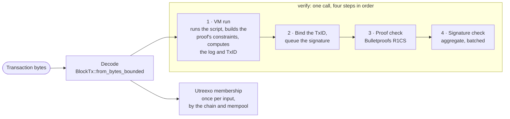

<!-- Generated blocks are rewritten by `report`. Prose outside them was written from run 2026-09-27-ryzen-ai-7-350-955d3d8.json; re-check it after a re-run. -->

# What a Flame transaction costs

Report 1 of 2. Next: [the node](../benchmarks.md), planned.

Every confidential Flame payment carries a zero-knowledge proof: a proof
that its amounts balance and none is negative, without revealing them. The
proof is what makes a payment private, and it is also the most expensive
part of it. The sender has to produce it, and every node has to check it.

This report measures both sides, for the transactions wallets actually
build: a payment with change, a payment from two contracts, a larger
four-way transaction, and a payout to twelve recipients. It answers three
questions:

- How long does verifying one transaction take, and where does the time
  go?
- How long does a wallet take to build and sign one, and how much memory
  does it need?
- How large is a transaction, and does its gas price cover the work it
  causes?

Everything here runs in FlameVM and the wallet library alone, on one CPU
core. Nothing depends on a running node, the network, or the size of the
chain. How a node behaves under load (building blocks, keeping proofs
current, restarting, serving wallets) is the subject of the next report.

All numbers come from one machine and one commit, stored in a results file
next to this page. The commands under "How to reproduce" regenerate them on
any machine.

## Key numbers

<!-- flamebench:begin key-numbers -->

| Metric | Value |
|---|---:|
| Verify a 1 → 2 payment | 2.10 ms |
| One core's verification rate, 1 → 2 | ~474 per second |
| Send a 1 → 2 payment, warm | 25.6 ms |
| Send a 1 → 2 payment, first in a new process | 34.9 ms |
| Size of a 1 → 2 payment | 1.9 KB |
| Most outputs in one transaction | 13 |
| 1 → 2 payments per block | 729 |

<!-- flamebench:end key-numbers -->

## Transaction shapes

A shape is written inputs → outputs: how many contracts a transaction
spends, and how many it creates. The four shapes are the transactions a
wallet actually builds:

- **1 → 2**, a payment with change: one contract spent, one output to the
  recipient and one back to the sender.
- **2 → 2**, the same payment, funded from two contracts.
- **4 → 4**, a larger four-way transaction: four contracts spent, three
  payments and change.
- **1 → 13**, a payout to twelve recipients plus change: the most outputs
  one proof holds.

Every shape spends confidential inputs, pays a fee of 1,000 sparks, and
carries an empty memo in each output's note. The amounts do not change the
cost: every range proof covers 64 bits, whatever the amount.

<!-- flamebench:begin shapes -->

| Shape | Inputs | Outputs | Gates, of 1,024 | Bytes |
|---|---:|---:|---:|---:|
| 1 → 2 | 1 | 2 | 137 (13%) | 1,921 |
| 2 → 2 | 2 | 2 | 141 (14%) | 2,089 |
| 4 → 4 | 4 | 4 | 281 (27%) | 2,885 |
| 1 → 13 | 1 | 13 | 885 (86%) | 4,227 |

Gates is `TxMetrics.multiplications`, the proof's multiplication gates. Bytes is `encoded_size()` of the signed transaction.

<!-- flamebench:end shapes -->

**What a gate is.** A proof is a circuit of multiplication gates, each
checking one product a × b = c, plus linear constraints that cost almost
nothing. Proving that a 64-bit amount is not negative takes one gate per
bit, so each output needs about 64 gates, and `mix`, which shows that the
inputs and outputs balance, adds a few per value. Proving and verifying grow
with the gate count rounded up to a power of two; the proof's size grows
only with its logarithm. One proof holds at most 1,024 gates, which is why
13 outputs fit and 14 do not.

## Verifying

Verifying is what every node does with every transaction it accepts.
`ExternalTx::verify_with_metrics` runs the script in FlameVM, checks the
proof, and checks the aggregate signature; that is what "verify" times.
Two things are left out of it. The Utreexo membership check of each input
is made by the chain and the mempool, not by `verify`, so it is measured on
its own and added once per input. Everything else a node does with a
transaction, from the network to the block, is the next report's subject.
Decoding the bytes is measured and shown, but not added.



"Verify" times steps 1 to 4 together. "Proof" is step 3 and "Signature"
is step 4, each measured on its own, outside the chain: a synthetic proof
with the same gate count, and the same signature checked alone. "VM and
other" is what remains of verify, steps 1 and 2. Decoding and Utreexo are
separate from verify.

**The proof's share is estimated.** The real proof is checked inside
`flamevm`, where it cannot be timed alone, so a synthetic proof with the
same gate count stands in for it: every gate constrained to 1 · 1 = 1, and
verified with the verifier's own generators. Its constraints are trivial
and it commits no variables, so it was expected to be a lower bound. In
this run it is not. For 1 → 2 and 1 → 13 it comes out at or above verify
minus the signature, and the tables clamp "VM and other" to zero and flag
both. A `perf` profile of `tx_cost/verify/1to13` settles the question: 95.5%
of the samples inside `verify_with_metrics` fall in the R1CS verification,
`bulletproofs::r1cs::Verifier::verify`, where the synthetic estimate says
100%. So the proof is the cost, as the estimate says, but the estimate runs
about five points high, and the VM run, the signature and the rest take
about 4.5% of verify, not nothing.

<!-- flamebench:begin cost-by-shape -->

<picture>
  <source media="(prefers-color-scheme: dark)" srcset="charts/transactions/cost-by-shape.dark.svg">
  
</picture>

| Shape | Verify | Proof (est.) | VM and other | Signature | Utreexo | Total | Decode | Bytes | Per second, one core |
|---|---:|---:|---:|---:|---:|---:|---:|---:|---:|
| 1 → 2 † | 2.10 ms | 2.07 ms (99%) | 0.00 µs | 30.2 µs | 7.95 µs | 2.11 ms | 12.4 µs | 1,921 | 474 |
| 2 → 2 | 2.14 ms | 2.10 ms (98%) | 4.78 µs | 37.4 µs | 15.9 µs | 2.16 ms | 14.7 µs | 2,089 | 463 |
| 4 → 4 | 3.74 ms | 3.67 ms (98%) | 16.9 µs | 51.9 µs | 31.8 µs | 3.77 ms | 19.6 µs | 2,885 | 265 |
| 1 → 13 † | 6.87 ms | 6.84 ms (100%) | 0.00 µs | 30.4 µs | 7.95 µs | 6.88 ms | 17.3 µs | 4,227 | 145 |

Proof (est.) is a synthetic R1CS verification with the same multiplier count, an estimate. VM and other is verify minus the estimate minus the signature. Utreexo is one membership check per input in a forest of 65,536 leaves. Total is verify plus Utreexo, and per second is one over it. Decode is `BlockTx::from_bytes_bounded`, as `flamed` decodes a submitted transaction.

† The synthetic estimate exceeds verify minus signature for 1 → 2 and 1 → 13, so VM and other is clamped to zero: cross-check the proof share with a profile.

<!-- flamebench:end cost-by-shape -->

<!-- flamebench:begin tps-per-core -->

<picture>
  <source media="(prefers-color-scheme: dark)" srcset="charts/transactions/tps-per-core.dark.svg">
  
</picture>

<!-- flamebench:end tps-per-core -->

<!-- flamebench:begin block-capacity -->

| Shape | Transactions per block | Payments per block | One core, full block |
|---|---:|---:|---:|
| 1 → 2 | 729 | 729 | 1.54 s |
| 2 → 2 | 709 | 709 | 1.53 s |
| 4 → 4 | 355 | 1,065 | 1.34 s |
| 1 → 13 | 112 | 1,344 | 770 ms |

Transactions per block is min(100,000 ÷ gates, 10,000), rounded down. Payments per block counts every output but the change. One core, full block is transactions per block × (verify + Utreexo per input).

<!-- flamebench:end block-capacity -->

The block rate is not fixed yet, so this report gives capacity per block
and no per-second figures for the chain.

What the numbers show:

1. **The proof is the cost.** Next to it, everything is small: the
   aggregate signature takes 30 to 52 µs, decoding 12 to 20 µs, and a
   Utreexo check 8 µs per input in a forest of 65,536 leaves.
2. **Cost steps at powers of two of the gate count.** This still holds. 1 →
   2 (137 gates) and 2 → 2 (141) cost the same, 2.10 and 2.14 ms: both round
   up to 256. 4 → 4 (281, so 512) costs 3.74 ms, and 1 → 13 (885, so 1,024)
   costs 6.87 ms. The synthetic proof takes 2.10, 3.67 and 6.89 ms at those
   sizes: each doubling costs 1.75 to 1.9 times as much. A second input that
   does not cross a power of two is almost free.
3. **Outputs are the cheap way to pay many recipients.** 1 → 13 pays twelve
   recipients for 6.88 ms and 4.2 KB, under 0.6 ms and 0.4 KB a payment,
   against 2.11 ms and 1.9 KB for one 1 → 2.
4. **Gates, not the count, fill a block.** Every shape reaches the limit of
   100,000 gates per block long before the limit of 10,000 transactions. A
   block holds 729 payments as 1 → 2, and 1,344 as 1 → 13. One core
   verifies a full block of any of the four shapes in 0.8 to 1.5 seconds.

## Sending

A send is everything a wallet does between choosing its coins and handing
the bytes to a node: preparing each input from its opening
(`InputSpec::confidential`), sealing each output's note, running the prover
over the script and proving (`build_transfer`), signing, and packaging the
`BlockTx`. It leaves out fetching the inputs' Utreexo proofs from a node,
the network, and choosing the coins.

**Warm and first sends.** The prover's generators, a table of 2 × 1,024
curve points, are built once per process, the first time it proves. A
wallet that stays up pays for them once. A command-line wallet that runs one
command per process pays for them on every send. Measured as the new
processes' median first send minus their median second send, the setup
takes about 12 ms, the same for every shape.

Two sources give the numbers. A warm send is the sum of criterion's
medians for its steps. A first send is measured whole: the median of the
first sends in 15 new processes. The chart stacks a warm send and the
setup. For the two small shapes a new process's second send ran 4% to 10%
faster than criterion's warm median, so that stack comes out longer than
the measured first send; for the two large shapes they agree. Both medians
behind the setup come from the new processes, so it does not depend on
that difference.

<!-- flamebench:begin send-latency -->

<picture>
  <source media="(prefers-color-scheme: dark)" srcset="charts/transactions/send-latency.dark.svg">
  
</picture>

| Shape | Warm send | New process: first send | New process: second send | Generator setup |
|---|---:|---:|---:|---:|
| 1 → 2 | 25.6 ms | 34.9 ms | 23.0 ms | 11.9 ms |
| 2 → 2 | 25.6 ms | 36.2 ms | 24.6 ms | 11.6 ms |
| 4 → 4 | 46.8 ms | 58.8 ms | 46.9 ms | 11.9 ms |
| 1 → 13 | 100 ms | 113 ms | 101 ms | 12.9 ms |

Warm send is prepare + build + sign + package, criterion medians. New process: two sends in each of 15 new processes pinned to the same core, medians. Generator setup is the median first send minus the median second send. The chart shows a warm send plus the setup; where the new processes' second sends run faster than the warm median, that sum exceeds their first send.

<!-- flamebench:end send-latency -->

<!-- flamebench:begin send-breakdown -->

<picture>
  <source media="(prefers-color-scheme: dark)" srcset="charts/transactions/send-breakdown.dark.svg">
  
</picture>

| Shape | Prepare | Build | Proving (est.) | Sealing (est.) | Prover run and other | Sign | Package | Warm send |
|---|---:|---:|---:|---:|---:|---:|---:|---:|
| 1 → 2 | 140 µs | 25.1 ms | 20.1 ms (78%) | 344 µs | 4.74 ms | 316 µs | 5.36 µs | 25.6 ms |
| 2 → 2 | 280 µs | 25.0 ms | 20.2 ms (79%) | 344 µs | 4.42 ms | 318 µs | 6.33 µs | 25.6 ms |
| 4 → 4 | 560 µs | 45.6 ms | 41.1 ms (88%) | 775 µs | 3.74 ms | 609 µs | 8.61 µs | 46.8 ms |
| 1 → 13 | 140 µs | 98.4 ms | 88.7 ms (88%) | 2.54 ms | 7.11 ms | 1.90 ms | 7.60 µs | 100 ms |

Prepare is `InputSpec::confidential` for every input. Build is `build_transfer`: sealing the notes, running the prover over the script, and proving. Proving (est.) is a synthetic R1CS proof with the same gate count, and its share is of the warm send. Sealing (est.) is outputs × `open_note`, which does the same key agreement, transcripts, AES-SIV and commitments. Prover run and other is build minus both estimates. Sign is everything `sign` computes; only moving the fields into the `ExternalTx` is left out. Package is `block_tx` and its encoding.

<!-- flamebench:end send-breakdown -->

<!-- flamebench:begin proof-capacity -->

<picture>
  <source media="(prefers-color-scheme: dark)" srcset="charts/transactions/proof-capacity.dark.svg">
  
</picture>

| Transfer | Outputs | Gates | Of 1,024 | Proves |
|---|---:|---:|---:|---|
| 1 → 2 | 2 | 137 | 13% | yes |
| 2 → 2 | 2 | 141 | 14% | yes |
| 4 → 4 | 4 | 281 | 27% | yes |
| 1 → 13 | 13 | 885 | 86% | yes |
| 1 → 14 | 14 | not observable | — | ✕ no: `VMError::R1CSProofConstruction` |

A transfer that fails to prove returns no metrics, so its gate count is not observable.

<!-- flamebench:end proof-capacity -->

<!-- flamebench:begin peak-memory -->

<picture>
  <source media="(prefers-color-scheme: dark)" srcset="charts/transactions/peak-memory.dark.svg">
  
</picture>

| Shape | Warm send | First send |
|---|---:|---:|
| 1 → 2 | 636,483 B (0.6 MB) | 964,579 B (1.0 MB) |
| 2 → 2 | 648,388 B (0.6 MB) | 976,484 B (1.0 MB) |
| 4 → 4 | 949,864 B (0.9 MB) | 1,277,960 B (1.3 MB) |
| 1 → 13 | 2,895,342 B (2.9 MB) | 3,223,438 B (3.2 MB) |

Peak heap: the most bytes in use at once between the start of a send and its end, beyond what was in use at its start, from a counting allocator. A warm send runs after the generator table was built, so the table is not part of it. A first send builds the table, so it is; the largest of the new processes' peaks is shown. 1 MB is 1,000,000 bytes.

<!-- flamebench:end peak-memory -->

**Memory.** A send's heap stays small: 0.6 MB at its highest for a 1 → 2
payment in a warm process, 1.0 MB for the first send in a new one, and 3.2
MB at most, for 1 → 13. The difference between a warm and a first send is
the generator table, 328,096 bytes in every shape. A few megabytes is well
within what a phone app or a browser tab can use, so memory does not stand
in the way of proving on either. Time is the likelier limit there: a phone
core or a WebAssembly build is slower than this laptop's fast core, and this
report does not measure either. The counts are heap only: the stack, the
code and the allocator's own overhead are not in them.

**Capacity.** A 1 → 14 transfer does not prove. `build_transfer` fails with
`VMError::R1CSProofConstruction`, because its gates would exceed the 1,024
the generators hold; a failed build returns no metrics, so its gate count
is not observable. The builder's own limit, `MAX_OUTPUTS`, is 16, so the
prover is what stops it. A wallet paying more than twelve recipients has to
split the payout into several transactions.

What the numbers show:

1. **Proving is most of a send.** By the synthetic estimate it takes 78% of
   a warm 1 → 2 send and 88% of the 4 → 4 and 1 → 13 sends. Like verifying,
   it steps with the padded gate count, 20.1, 41.1 and 88.7 ms at 256, 512
   and 1,024, but each doubling costs twice as much or a little more.
2. **Sending costs about 12 to 15 times verifying.** A warm 1 → 2 send takes
   25.6 ms against 2.10 ms to verify it; a 1 → 13 send takes 100 ms against
   6.87 ms.
3. **The rest is small, but not free.** Sealing a note costs about as much as
   opening one, 172 to 195 µs, so 13 notes take an estimated 2.5 ms.
   Signing takes 0.3 ms for one input and 1.9 ms for 1 → 13, because `sign`
   derives the txid twice over a log that holds every output and its note.
   Packaging takes under 10 µs.

## Size and gas

**What gas is.** Gas is FlameVM's deterministic count of verifier work.
The VM charges it from a price list that the prover and the verifier both
apply, so a transaction's gas depends on the transaction alone, never on
the hardware. The prices that matter here are 1 gas per instruction, 1 per
allocated byte or item, 350 per signature, 120 per R1CS item, and 2,000 to
finish an external proof. The schedule was calibrated on an arm64 machine
in 2026-08, with the rule that 1 gas is about 100 ns of verifier work,
rounded up: there a signature measured 33.4 µs against its 350 gas.
Gas bounds the work in one transaction and in one block. It is not priced
in Flame yet: the fee is a flat amount the sender chooses.

**What the bytes contain.** A transaction's bytes are its proof, its
script, its witness bag and its signature. The script carries one note per
output, 89 bytes plus the memo, next to the output's commitments and
predicate. From 1 → 2 to 1 → 13 the size grows from 1.9 KB to 4.2 KB, about
0.2 KB an output; the proof itself grows only with the logarithm of its
gates.

<!-- flamebench:begin gas-check -->

<picture>
  <source media="(prefers-color-scheme: dark)" srcset="charts/transactions/gas-check.dark.svg">
  
</picture>

| Shape | Gates | Gas | Gas, mix per gate | Measured | Predicted by gas | Off by | Predicted, mix per gate | Off by |
|---|---:|---:|---:|---:|---:|---:|---:|---:|
| 1 → 2 | 137 | 6,238 | 20,758 | 2.10 ms | 624 µs | −70% | 2.08 ms | −1% |
| 2 → 2 | 141 | 8,216 | 22,136 | 2.14 ms | 822 µs | −62% | 2.21 ms | +3% |
| 4 → 4 | 281 | 17,932 | 41,932 | 3.74 ms | 1.79 ms | −52% | 4.19 ms | +12% |
| 1 → 13 | 885 | 37,918 | 117,118 | 6.87 ms | 3.79 ms | −45% | 11.7 ms | +71% |

Predicted is gas × 100 ns. Measured is the verify median. Off by is predicted over measured, minus one. Gas, mix per gate = gas − 120 × (m + n)² + 120 × gates, where m is the inputs plus one for the fee and n the outputs: `mix`'s R1CS charge replaced by 120 per real gate, and every other charge as today.

<!-- flamebench:end gas-check -->

**The finding: gas underprices verification, and `mix` is why.** Measured
verify time exceeds gas × 100 ns in every shape: gas today predicts only 30%
to 55% of it. Most of the gap is one charge. `mix` pays 120 gas for each of
(m + n)² items, where m is the inputs plus one for the fee and n the
outputs, and nothing for the gates its proof really adds: about 64
range-proof gates per output. A 1 → 2 payment is charged for 16 items,
1,920 gas, while its proof has 137 gates.

Charged 120 gas per real gate instead, with every other price as it is, the
prediction lands within 3% of the measurement for 1 → 2 and 2 → 2, 12% above
it for 4 → 4, and 71% above it for 1 → 13. Verify time grows more slowly
than the gate count, so a flat price per gate overprices the largest
proofs. This report changes nothing in the schedule; it is a finding for
FlameVM's gas prices.

## How it was measured

- **Fixed seeds.** The fixtures, and the `r` every send draws, come from
  seeded generators, so every run builds the same transactions, byte for
  byte, and times fresh sends of them.
- **Criterion medians, one pinned core.** Every timing is a criterion
  median on CPU 2, a fast core, pinned with `taskset`. The 95% confidence
  interval of every median is in the results file.
- **Estimated shares.** The proof's share of verify and the proving share of
  a send come from synthetic R1CS proofs with the same gate count; sealing
  is outputs × `open_note`. Everything else is measured. `send/sign` times
  everything `sign` computes except moving the fields into the transaction,
  because a fresh `UnsignedTx` costs a proof.
- **First sends and memory.** First sends ran in 15 new processes per shape,
  each pinned to the same core, two sends each, and the tables take the
  medians. Peak heap comes from a counting allocator that counts only while
  a send runs.
- **The profile.** The `perf` cross-check used a separate build with symbols
  and frame pointers, for the profile only; its numbers are not in the
  tables.

## Limits

- **One laptop core.** The laptop ran its `balanced` power profile, with
  the desktop session up: compare ratios, not milliseconds.
- **No batch verification, empty memos.** Each proof is verified on its
  own, and every note's memo is empty; a memo adds its bytes to the note.
- **No node work.** Decoding from the network, the mempool, building blocks
  and keeping proofs current are the next report's subject.

## How to reproduce

<!-- flamebench:begin reproduce -->

```text
cargo run -p flamebench --bin report -- --cpu-order
cargo bench -p flamebench --no-run
taskset -c 2 cargo bench -p flamebench --bench tx_cost
taskset -c 2 cargo bench -p flamebench --bench send
cargo run -p flamebench --bin report
```

To redraw the charts and these blocks from the committed results file, without running anything:

```text
cargo run -p flamebench --bin report -- --results docs/benchmarks/results/transactions/2026-09-27-ryzen-ai-7-350-955d3d8.json
```

On the machine below, `tx_cost` ran for 3 min 34 s and `send` ran for 6 min 5 s, fixtures and new processes included. Building first takes longer.

<!-- flamebench:end reproduce -->

## Machine

<!-- flamebench:begin footer -->

- Machine: AMD Ryzen AI 7 350 w/ Radeon 860M, 16 logical CPUs
- Cores: 2, 4, 6, 0 (fast cores); 1, 3, 5, 7 (compact cores); 10, 12, 14, 8, 9, 11, 13, 15 (second hardware threads)
- Pinned to: CPU 2, a fast core, up to 5.09 GHz
- Governor: `powersave`, energy preference `balance_performance`
- Platform profile: `balanced`
- Power: mains
- Compiler: `rustc 1.90.0 (1159e78c4 2025-09-14)`
- Commit: `955d3d8`, with uncommitted changes
- Date: 2026-09-27
- Results file: [2026-09-27-ryzen-ai-7-350-955d3d8.json](results/transactions/2026-09-27-ryzen-ai-7-350-955d3d8.json)

<!-- flamebench:end footer -->

## Not covered yet

- **The first spend of a clear input.** A genesis allocation, or a token
  issued in cleartext, is a `ClearToken` until its first spend
  (`InputSpec::clear`), which pays out into confidential outputs. The
  fixtures build such transactions to fund the shapes, but none is timed.
  A "1 → 2 from a clear input" shape would measure it.
- **A payment in an issued token.** The fee is always paid in Flame, so a
  token payment usually spends a token and a Flame contract and creates
  three outputs: 2 → 3. It is also the only proof that balances two
  flavors at once. It waits for the wallet library to issue tokens: the VM
  has `issuepriv` and `issuepub`, but `flamepayments` has no issuance code
  yet.
- **A transfer that stays in cleartext.** It cannot pay a fee today. `fee`
  pushes a `WideToken` debt that only `mix` can settle, and `mix` always
  outputs confidential tokens, so every fee-paying transaction carries a
  proof. Without a fee, a clear transfer needs no proof at all. This is a
  question for FlameVM's design, not a benchmark.
