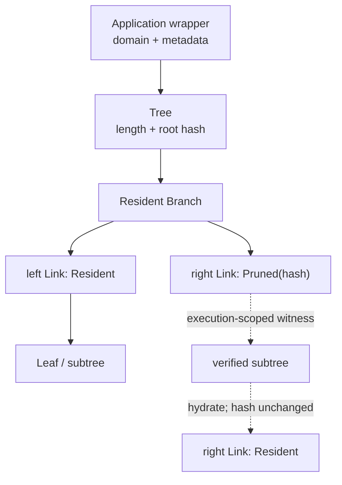

# Authenticated compression

## Status and scope

This is an exploratory subproject. It does not yet define consensus rules or
describe implemented behavior.

Here, **compression** means authenticated pruning: replace resident data with a
small cryptographic commitment while keeping enough witness data elsewhere to
restore selected contents later. **Decompression** means verifying that witness
data against the commitment and materializing it for execution. This is not an
ordinary byte-compression codec and does not, by itself, guarantee that the
witness data remains available.

The immediate scope is actor state, Dict branches, and Cells. A common ordered
Merkle tree may also cover Cell payloads, Taproot program trees, and
Utreexo items. Sharing the primitive does not require every use to share the
same update or ownership policy.

## Core insights

- An actor whose storage lease expires can be **frozen instead of destroyed**.
  Its code and state are replaced by commitments, so its identity and ownership
  relationships survive without keeping the complete state resident.
- Freezing must not retire linear values hidden in actor state. Tokens and other
  non-droppable values cannot be destroyed in bulk; they remain committed under
  the frozen state root until the actor explicitly accesses and disposes of
  them according to normal VM rules.
- A Dict can be committed as a whole while being materialized piece by piece.
  An operation need only provide the branches it reads or changes.
- An actor may eventually be allowed to prune selected Dict branches while it
  is still active, reducing resident storage without freezing all of its state.
- Opening a Cell and restoring a frozen actor are instances of the same basic
  operation: resolve a short authenticated reference using witness data.
- A Cell may itself contain a Dict with pruned branches. Restoring the Cell does
  not require eagerly restoring every branch of every nested Dict.
- Witness data may be supplied explicitly as program data, implicitly through
  the transaction execution context, or through both interfaces.
- These cases may use one content-addressed witness format, one verifier, and
  one set of availability and charging rules.

## One ordered Merkle tree

Dict entries, Cell payload items, Taproot leaves, and Utreexo items all form an
ordered sequence. The containing type decides what the order means. The shared
`Tree` only commits the sequence and records which subtrees are resident.

```text
Tree<Item> {
    len: u64,
    root: Option<Link<Item>>,       // None iff len == 0
}

Link<Item> {
    hash: Hash,
    node: Option<Box<Node<Item>>>,  // Some = resident, None = pruned
}

Node<Item> {
    Leaf(Item),
    Branch {
        left: Link<Item>,
        right: Link<Item>,
    },
}
```

There is no key policy, list/map tag, or VM capability flag inside `Tree`. A
`Branch` only points to its left and right `Link`s; each link's
optional node says whether that subtree is resident or pruned. The root can be
pruned in the same way as any child.

The canonical shape is the ordered-list shape already used by the repository's
Merkle code and Taproot tree:

```text
len == 0: empty
len == 1: Leaf(item[0])
len >= 2:
    left_len  = len.next_power_of_two() / 2
    right_len = len - left_len
    Branch(Tree(items[..left_len]), Tree(items[left_len..]))
```

The expected length of every subtree follows from the root `len` and its path,
so it need not be repeated in each node. There are no empty or one-child
branches. The content identity is `(len, root.hash)`; the containing type must
commit both values and use its own hash domain.

```text
leaf   = H(application_domain, "leaf", item_commitment)
branch = H(application_domain, "node", left.hash, right.hash)
empty  = H(application_domain, "empty")
wrapped_tree = H(application_domain, "tree", len, empty | root.hash)
```

`wrapped_tree` is available to applications that want one digest. An existing
application may instead keep its established bare root when its tagged tree
shape and wrapper/proof rules already determine the expected length.

A `Link` carries the same subtree hash whether its node is present or absent.
Hydration verifies the witness at the subtree length implied by its path and
fills the optional node; the content root does not change. If persistent
residency affects execution, the containing object commits that residency
separately. A private node cache never changes consensus-visible residency.



### Application ordering

`Tree` does not interpret keys:

- Sequential containers use their natural item order. The leaf rank is implied
  by `len` and the Merkle path, so an ordinal need not be stored in the leaf.
- Keyed containers put the key in the leaf item and sort leaves before building
  the Tree.
- A hidden subtree is located by its path and hash. It needs no global tag or
  synthetic key merely because its body is pruned.

A Dict always stores keyed leaves uniformly:

```text
DictEntry {
    key: Int253,
    value: Value,
}

Dict tree order = strictly increasing DictEntry.key
```

There is no list/map tag in memory or in the Dict commitment. Flat
serialization alone checks whether the keys are exactly `0..len-1`: if so it
omits the keys and writes list form; otherwise it writes every key. Decoding
either form recreates the same explicit keyed entries. It does not preserve
sticky capability history or Tree residency: the current flat codec
canonicalizes those from the present entries. A compressed-state envelope is a
separate format. This matches the current `BTreeMap`-backed Dict behavior.

### Uses of Tree

```text
CellPayload          = Tree<Value>
DictCommitment       = Tree<DictEntry>
PredicateTree.leaves = Tree<PredicateLeaf>
Utreexo.roots[level] = Option<Link<CellLeaf>> // subtree len = 2^level
```

| Use | Ordered Tree item | Wrapper behavior |
| --- | --- | --- |
| Cell payload | `Value`, in payload order | Cell construction enforces portability; Cell identity commits predicate, anchor, payload length, and Tree root. |
| Dict | `(Int253, Value)`, ascending and unique by key | The resident `BTreeMap` supplies order; flat list/map encoding is derived and is not Tree state. |
| Taproot predicate | `PredicateLeaf`, in current program/blinding vector order | The Tree root feeds the internal-key tweak; each program/blinding pair retains its randomized orientation. |
| Utreexo | `CellLeaf` committing a `CellID`, in current forest-state order | The forest keeps its perfect-tree roots; append, deletion, normalization, and proof catchup remain Utreexo policy. |

For Taproot, an opening consists of the program leaf and a path whose sibling
links are pruned hashes. The current balanced split already matches `Tree`; a
future keyed/blinded layout can put the label in the leaf and sort before
building without changing the generic type. In this proposed representation,
each current Taproot neighbor hash maps to a `Link` with no resident node at its
existing path; it needs no arbitrary item number.

For Utreexo, each occupied forest root is a perfect instance of the same node
and link shape. The forest occupancy bitmap supplies each root's length
`2^level`. The persistent `Forest` currently stores only root hashes, while
resident bodies live in `WorkForest`; `Link` is a proposed common
representation of those two views. Utreexo's `modified` flag is transactional
working metadata, not a generic Tree residency flag. Proof positions describe
paths in the current forest state and may change when normalization relocates
survivors.

Cell IDs and actor state roots currently commit flat `Value` encodings; Dict has
no independent Tree root. Taproot and Utreexo already use the same ordered
binary shape and may reuse the in-memory `Link`/`Node` representation without a
consensus change only while exposing their existing bare roots and hash
formulas. Adopting `wrapped_tree` or new metadata is a versioned consensus
migration.

### Proofs and limitations

A generic opening proof binds the application domain, `(len, root.hash)`, the
leaf rank, item, and sibling hashes. `Tree` itself supports membership and
subtree hydration. The containing type supplies semantic proofs:

- Cell, Taproot, and Utreexo address leaves by rank or path.
- Dict membership opens a leaf whose stored key equals the requested key.
- Dict absence in a non-empty Tree proves consecutive predecessor/successor
  ranks with `predecessor.key < requested < successor.key`, or proves
  `requested < first.key` / `last.key < requested` at a boundary. An empty Tree
  proves absence directly.
- Dict insertion and removal prove the neighboring keys and every affected
  canonical Tree path.

Strict ordering and unique keys are Dict admission invariants, not properties
proved by one generic membership path. A pruned Dict link can be created only
by pruning a fully validated or already consensus-recognized Dict root. An
unrecognized pruned root requires full materialization unless a later
Dict-specific bounds commitment is added; boundary proofs alone cannot prove
the internal ordering of a hidden subtree.

This minimal Tree is deliberately not a search tree. A fully resident Dict uses
its existing `BTreeMap` index. For a pruned Dict, the witness provider resolves
`(dict root, key)` to a membership or adjacency proof; `Tree` verifies that
proof by rank. Add Dict-specific authenticated key bounds only if direct
in-tree routing is later worth the extra metadata.

The canonical ordered-list shape makes append efficient, but insertion or
removal in the middle can re-form a large suffix and require an O(n) update
proof. Do not promise O(log n) arbitrary Dict mutation. If measurements require
it, evaluate a keyed trie or another content-derived balancing rule as a
separate Tree implementation.

Missing witness data is different from proven absence. Reaching a pruned link
without its execution-scoped witness fails `MissingWitness`; a valid Dict
adjacency/boundary proof produces normal not-found behavior.

Linearity is enforced by the containing type. A witness proves bytes; it never
mints a stack `Value`. Hydration replaces a pruned link inside the same uniquely
owned object. Extracting a token-bearing item atomically consumes the old
wrapper and returns a new wrapper plus the value; on failure, both the wrapper
and returned call arguments roll back together. Read-only access may expose
only copyable values.

## Actor lifecycle

The proposed lifecycle is:

```text
resident actor
    | storage expiry or explicit freeze
    v
frozen actor: ActorID + code/state commitments + capability summaries
    | transaction supplies the witnesses needed by this execution
    v
transiently materialized actor
    | successful save
    v
resident, partially pruned, or frozen actor state
```

A frozen actor remains addressable. A transaction that supplies sufficient
witnesses can execute it and save a new state. Missing witness data causes that
execution to fail; it does not erase the actor.

Explicit permanent actor destruction, if retained, is a separate operation. It
must prove that no linear value is being discarded rather than inheriting the
old lease-expiry bulk-destruction behavior.

Freezing changes the meaning of storage rent: rent pays for resident,
witness-free availability, not for logical existence. The permanent actor
record still has a global cost, so consensus must eventually price or
accumulate those records rather than assuming that a 32-byte root is free.

## Partially materialized Dicts

A Dict always stores explicit `(Int253, Value)` entries. Exact keys `0..len-1`
only enable the shorter list-style flat encoding; they never change the Dict or
Tree representation. Its canonical **content root** is independent of which
links are resident.

Tree links remain minimal hashes. Dict-wide metadata belongs to an authenticated
Dict envelope:

```text
DictEnvelope {
    tree: (len, root_hash),
    logical_bytes,
    portable,       // sticky for the Dict's lifetime
    droppable,      // sticky, with an empty-Dict override
}
```

This preserves the O(1) capability checks even when entries are hidden. An
empty Dict is droppable regardless of its former sticky flag. Pruning and
hydration do not copy or move VM values; they only change whether the same
committed links have resident bodies.

Authenticating these fields is a new compressed-state rule. The current flat
Dict encoding omits sticky history and cannot by itself round-trip this
envelope.

A keyed lookup asks the current execution's witness provider for a membership
or adjacency proof under `(tree commitment, key)`. A valid absence proof
produces normal Dict not-found behavior. A missing proof is a distinct hard
`MissingWitness` failure. An update consumes the old authenticated paths and
commits new ones, so a witness for an earlier root cannot be replayed after
mutation.

No per-link key bounds or capability summaries are needed initially. Add
Dict-specific authenticated metadata only if direct routing or partial-branch
operations prove worth the extra commitment and proof bytes.

Optional partial compression should be built on this same representation:
pruning a chosen branch changes residency and storage charges, not the content
root. Because residency controls whether execution requires a witness, the
actor record must separately commit its residency map (or an equivalent
availability root). Local caches never change that committed map. There is no
need for a second compression format.

## Cells and frozen actors

Cells and frozen actors differ in ownership but can share restoration
machinery:

| Property | Cell | Frozen actor |
| --- | --- | --- |
| Identity | Cell ID and anchor | Actor ID and state version/root |
| State | Immutable, single-use | Mutable after authenticated restoration |
| Witness result | Cell payload/program | Actor code and selected state branches |
| Consumption | Cell is opened or spent | Actor remains and receives a new state root |

Both can use content-addressed witness blobs and authenticated paths. Cells may
also contain compressible Dicts, so restoration should be lazy across nested
objects rather than recursively materializing everything.

## Witness delivery

Two interfaces are useful:

1. **Explicit:** the program receives witness values and invokes a restore
   operation. This is simple and visible, but exposes proof plumbing to every
   contract.
2. **Implicit:** the transaction carries a witness bag outside the program.
   Dict lookup, Cell opening, or actor restoration asks the execution context
   for the required object. Programs use short IDs and keys.

The implicit form is the better default for ordinary programs. An explicit
form may remain useful when a contract needs to inspect or forward proof data.
Both forms should feed the same verifier.

Witness availability must be scoped to a particular execution. A block may
deduplicate identical bytes physically, but it must not make every block
witness visible to every transaction or message. Otherwise one transaction can
change from failure to success merely because an unrelated transaction happens
to carry the missing witness.

A possible block representation is:

```text
WitnessTable:       WitnessID -> bytes
ExecutionManifest: transaction/message -> ordered WitnessIDs
```

The ordered manifest has its own root. An external transaction's TxID and
signature commit that root, and each asynchronous `MessageID` commits the root
of the witness IDs visible at delivery. A block may deduplicate identical bytes
in `WitnessTable`, but that physical optimization never expands a manifest.

Consensus rules should include:

- an execution sees only its own manifest;
- there is no fallback to a node's private cache, archive, or network;
- a manifest reference with absent bytes or a hash mismatch makes the block
  invalid;
- a required witness absent from the manifest causes deterministic execution
  failure;
- valid witness data guarantees availability of that object, though execution
  may still fail for another reason;
- unused witnesses are allowed only if they are committed and charged; and
- asynchronous messages commit to the witness scope they will receive, so a
  message ID also commits to any witness-dependent behavior.

A referenced witness missing from the table or failing its hash makes the block
invalid. A witness needed by execution but absent from that execution's
manifest produces `MissingWitness`: an external transaction is rejected, while
a failed asynchronous delivery follows the normal bounce path. Synchronous
calls inherit the enclosing manifest and their existing call-failure behavior.

For delayed asynchronous delivery, the message commits ordered witness hashes,
not necessarily the bytes. The later delivery block supplies those bytes in
its table and scopes them to that message; if nobody retains them, delivery
deterministically fails. This keeps each validating block self-contained and
does not charge the message queue for duplicate witness blobs.

Synchronous calls can share the enclosing execution's witness scope. The actor
and state root against which a proof is checked must still be explicit in the
lookup key.

## Common and adjacent applications

| Application | Common pattern | Important difference |
| --- | --- | --- |
| Actor state | Root plus selectively restored Tree | Mutable identity and linear values |
| Dict | Ordered keyed leaves plus rank proofs | Fine-grained reads and updates |
| Cell | ID plus committed payload Tree | Immutable and single-use |
| Utreexo | Dense forest plus membership proof | Batch updates and proof catchup |
| Taproot program tree | Ordered program/blinding Tree | Usually reveals one immutable branch |

Utreexo already demonstrates the compact-state-plus-witness model. Taproot
demonstrates selective program revelation. Use both as conformance cases for
the common commitment and witness conventions, while keeping Utreexo's
forest/catchup rules and Taproot's internal-key tweak outside the generic layer.

## Safety requirements

Any design in this subproject must preserve these properties:

- **Canonical state:** resident and pruned representations have the same
  content root, while consensus separately commits any residency distinction
  that affects witness requirements.
- **Linearity:** hiding a value never makes it droppable or duplicable.
- **Scoped availability:** success cannot depend on witnesses supplied to an
  unrelated execution or retained privately by a node.
- **Deterministic failure:** missing, malformed, and valid absence proofs have
  distinct consensus outcomes.
- **Atomic rollback:** a failed execution restores the same actor root,
  residency metadata, and witness obligations it started with.
- **Bounded work:** witness bytes, proof verification, materialized nodes, and
  resulting resident storage are charged and limited.
- **Block self-containment:** validation does not require fetching data from the
  network during execution.
- **Data availability:** commitments preserve integrity, not availability;
  owners or archival services must retain the witness data needed for future
  restoration.

Witnesses included in a block also reveal their data to block observers.
Privacy, encryption, and zero-knowledge access are separate concerns.

## Open decisions

- Canonical Tree node encoding, application hash domains, proof format, and size
  bounds.
- Whether O(n) worst-case middle updates are acceptable for Dict, or a later
  keyed/content-derived layout is needed.
- Whether Dict proofs need authenticated key bounds for direct routing, rather
  than witness-supplied rank and adjacency paths.
- Whether Utreexo uses the common tree or only its commitment/witness
  conventions while retaining the current forest wrapper.
- Whether Taproot leaves use successive positions or blinded derived keys.
- Whether actors freeze automatically on lease expiry, explicitly, or both.
- Which actor metadata remains resident and how its permanent cost is bounded.
- Whether actor code can be pruned separately from state.
- Exact explicit and implicit witness APIs.
- Canonical encoding and data-retention obligations for witness manifests
  committed by asynchronous messages and bounces.
- Whether partial Dict pruning is actor-controlled or only a storage-layer
  representation choice.
- Maximum String and program sizes, so large portable data has one canonical
  chunking path through Dicts.
- Which witness bytes are retained across reorganization and archival pruning.
- How much implementation Utreexo and Taproot can share without replacing
  their useful domain-specific wrappers.

## Proposed work order

1. Specify Tree's canonical split, node/link encoding, application-domain
   hashes, pruning, authorization-bound witness scoping, and failure semantics.
2. Extend or wrap the existing Merkle implementation with optional resident
   link bodies. Test empty, singleton, uneven, and perfect trees; opening
   proofs; and prune/hydrate root stability.
3. Add the Dict envelope, keyed-leaf ordering, flat list/map serialization,
   membership/adjacency proofs, rollback, and hidden-token droppability tests.
4. Add a transaction-scoped witness provider and block manifest.
5. Freeze and restore actor state using the Dict mechanism, while treating a
   bounded non-Dict state as one witness blob.
6. Reuse the provider for Cell restoration and nested Dict payloads.
7. Validate the commitment and witness conventions against Utreexo proof
   catchup and Taproot openings; keep their forest and tweak wrappers
   domain-specific, sharing exact node/proof code only if that is simpler.
