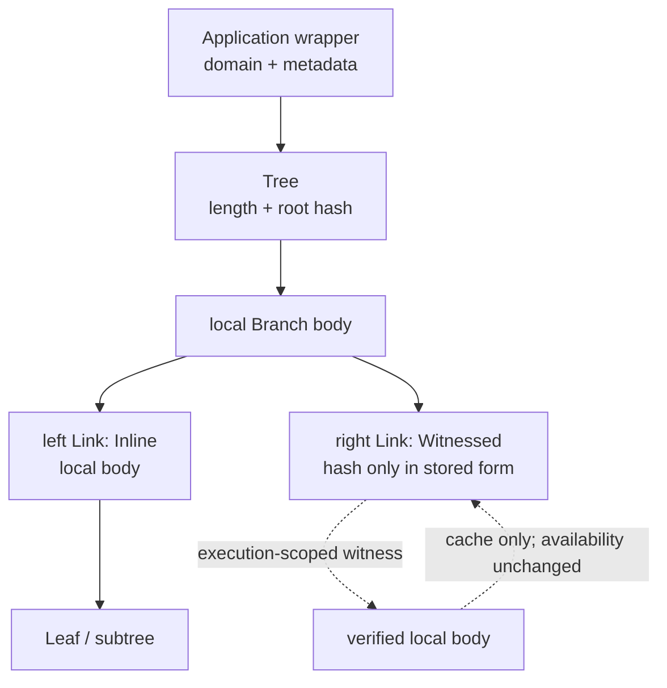
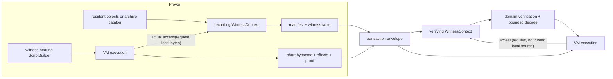

# Authenticated compression

## Status and scope

This is an exploratory subproject. It does not yet define consensus rules or
describe implemented behavior.

Here, **compression** means authenticated pruning: replace resident data with a
small cryptographic commitment while keeping enough witness data elsewhere to
restore selected contents later. **Decompression** means verifying that witness
data against the commitment and materializing it for execution. This is not an
ordinary byte-compression codec and does not, by itself, guarantee that the
witness data remains available.

The immediate scope is actor state, portable storage-bound Dict branches, and
whole-Contract preimages. A common ordered Merkle tree may cover Taproot program
trees and Utreexo items.
Merkleizing the Contract payload itself is a possible later format migration, not
part of the first Contract design. Sharing a primitive does not require every use
to share the same update or ownership policy.

## Core insights

- An actor whose storage lease expires can be **frozen instead of destroyed**.
  Its code and state are replaced by commitments, so its identity and ownership
  relationships survive without keeping the complete state resident.
- Freezing must not retire linear values hidden in actor state. Tokens and other
  non-droppable values cannot be destroyed in bulk; they remain committed under
  the frozen state root until the actor explicitly accesses and disposes of
  them according to normal VM rules.
- A portable Dict crossing into Contract or actor storage can be committed as a
  whole while being materialized piece by piece. An operation need only
  provide the branches it reads or changes.
- An actor may eventually be allowed to prune selected Dict branches while it
  is still active, reducing resident storage without freezing all of its state.
- Opening a Contract and restoring a frozen actor are instances of the same basic
  operation: resolve a short authenticated reference using witness data.
- A later versioned Contract/Value format may contain a Dict with witnessed
  branches. Restoring the Contract then need not eagerly restore every branch of
  every nested Dict.
- Witness data may be supplied explicitly as program data, implicitly through
  the transaction execution context, or through both interfaces.
- These cases may use one content-addressed witness transport and one set of
  availability and charging rules. Contract, Predicate, Actor, Dict, and Utreexo
  still verify their own commitments and proof semantics.

## One ordered Merkle tree

Stored Dict entries, Taproot leaves, and Utreexo items all form an ordered
sequence. The containing type decides what the order means. The shared `Tree`
commits the sequence and records which subtrees are inline or witnessed.

```text
Tree<Item> {
    len: u64,
    root: Option<Link<Item>>,       // None iff len == 0
}

Link<Item> {
    hash: Hash,
    availability: Inline | Witnessed,
    local: Option<Box<Node<Item>>>, // prover source or execution cache
}

Node<Item> {
    Leaf(Item),
    Branch {
        left: Link<Item>,
        right: Link<Item>,
    },
}
```

There is no key policy, list/map tag, or VM capability flag inside `Tree`. A
`Branch` only points to its left and right `Link`s. Each link records whether
its body is stored inline or must be supplied as a witness. The root can be
witnessed in the same way as any child.

`availability` and `local` must remain separate. A prover can have the complete
body of a `Witnessed` link locally so it can construct a transaction witness;
a verifier can cache a body after checking that witness. Neither local copy
makes the link `Inline`, because consensus-visible witness requirements must
not depend on a wallet or node cache. Conversely, an `Inline` link is encoded
inside its containing object and must decode with a body.

The canonical shape is the ordered-list shape already used by the repository's
Merkle code and Taproot tree:

```text
len == 0: empty
len == 1: Leaf(item[0])
len >= 2:
    left_len  = len.next_power_of_two() / 2
    right_len = len - left_len
    Branch(Tree(items[..left_len]), Tree(items[left_len..]))
```

The expected length of every subtree follows from the root `len` and its path,
so it need not be repeated in each node. There are no empty or one-child
branches. The content identity is `(len, root.hash)`; the containing type must
commit both values and use its own hash domain.

```text
leaf   = H(application_domain, "leaf", item_commitment)
branch = H(application_domain, "node", left.hash, right.hash)
empty  = H(application_domain, "empty")
wrapped_tree = H(application_domain, "tree", len, empty | root.hash)
```

`wrapped_tree` is available to applications that want one digest. An existing
application may instead keep its established bare root when its tagged tree
shape and wrapper/proof rules already determine the expected length.

A `Link` carries the same subtree hash in both availability states. Transient
hydration verifies the witness at the subtree length implied by its path and
fills `local`; neither the content root nor `availability` changes. Explicit
pruning or restoration changes `availability` and therefore the containing
object's storage representation, while leaving the content root unchanged.
The containing object must commit that representation whenever it changes
which executions require witnesses.

The canonical availability commitment is a domain-separated frontier over
stored links. The containing application supplies `d`:

```text
A_d(empty) = H(d, "availability-empty")
A_d(Witnessed { hash }) = H(d, "witnessed", hash)
A_d(Inline Leaf { hash }) = H(d, "inline-leaf", hash)
A_d(Inline Branch { hash, left, right }) =
    H(d, "inline-branch", hash, A_d(left), A_d(right))
```

An `Inline` link must contain and validate its local body. A `Witnessed` link
commits only its subtree hash; descendant availability is deliberately hidden
behind that frontier. Persistent restoration supplies a body and chooses a new
validated frontier. A containing object commits `A_d(root)` as its
`availability_root`. Stored-byte charges are derived from this canonical
frontier and its inline encodings rather than trusted as independent metadata.



### Application ordering

`Tree` does not interpret keys:

- Sequential containers use their natural item order. The leaf rank is implied
  by `len` and the Merkle path, so an ordinal need not be stored in the leaf.
- Keyed containers put the key in the leaf item and sort leaves before building
  the Tree.
- A hidden subtree is located by its path and hash. It needs no global tag or
  synthetic key merely because its body is pruned.

A portable Dict admitted to compressed storage uses keyed leaves uniformly:

```text
DictEntry {
    key: Int253,
    value: Value,
}

Dict tree order = strictly increasing DictEntry.key
```

There is no list/map tag in memory or in the Dict commitment. A fully resident
Dict keeps the same entries in its current `BTreeMap`; a partially witnessed
Dict may cache only opened entries, so the Tree and envelope are authoritative
and cache absence is never key absence. Flat
serialization alone checks whether the keys are exactly `0..len-1`: if so it
omits the keys and writes list form; otherwise it writes every key. Decoding
either form recreates the same explicit keyed entries. The current flat codec
rebuilds capability flags from the present entries, losing sticky history, and
has no Tree-availability representation. A compressed-state envelope is a
separate format. This matches the current `BTreeMap`-backed Dict behavior.

### Uses of Tree

```text
StoredDictCommitment = Tree<DictEntry>
PredicateTree.leaves = Tree<PredicateLeaf>
Utreexo component    = ordered perfect tree of ContractLeaf // conceptual adapter
```

| Use | Ordered Tree item | Wrapper behavior |
| --- | --- | --- |
| Stored Dict | `(Int253, portable Value)`, ascending and unique by key | A resident `BTreeMap` supplies order; flat list/map encoding is derived and is not Tree state. |
| Taproot predicate | `PredicateLeaf`, in current program/blinding vector order | The Tree root feeds the internal-key tweak; each program/blinding pair retains its randomized orientation. |
| Utreexo | `ContractLeaf` committing a `ContractID`, in current forest-state order | The forest keeps its perfect-tree roots; append, deletion, normalization, and proof catchup remain Utreexo policy. |

For Taproot, an opening consists of the program leaf and a path whose sibling
links are witnessed hashes. The current balanced split already matches `Tree`; a
future keyed/blinded layout can put the label in the leaf and sort before
building without changing the generic type. In this proposed representation,
each current Taproot neighbor hash maps to a `Witnessed` link with no local body
at its existing path; it needs no arbitrary item number.

For Utreexo, each occupied forest root is a perfect instance of the same node
and link shape. The forest occupancy bitmap supplies each root's length
`2^level`. The persistent `Forest` currently stores only root hashes, while
resident bodies live in `WorkForest`; `Link` is a proposed common
representation of those two views. Utreexo's `modified` flag is transactional
working metadata, not a generic Tree availability flag. Proof positions describe
paths in the current forest state and may change when normalization relocates
survivors.

Contract IDs and actor state roots currently commit flat `Value` encodings; Dict has
no independent Tree root. Taproot and Utreexo already use the same ordered
binary shape. Initially they should reuse only the request/transport and proof
conventions; replacing `Forest`/`WorkForest` or Taproot's current proof structs
with `Link`/`Node` is worthwhile only if it makes their code smaller. Adopting
`wrapped_tree` or new metadata is a versioned consensus migration.

### Proofs and limitations

A generic opening proof binds the application domain, `(len, root.hash)`, the
leaf rank, item, and sibling hashes. `Tree` itself supports membership and
subtree hydration. The containing type supplies semantic proofs:

- Taproot and Utreexo address leaves by rank or path.
- Dict membership opens a leaf whose stored key equals the requested key.
- Dict absence in a non-empty Tree proves consecutive predecessor/successor
  ranks with `predecessor.key < requested < successor.key`, or proves
  `requested < first.key` / `last.key < requested` at a boundary. An empty Tree
  proves absence directly.
- Dict insertion and removal prove the neighboring keys and every affected
  canonical Tree path.

Strict ordering and unique keys are Dict admission invariants, not properties
proved by one generic membership path. A `Witnessed` Dict link can be created
only by pruning a fully validated or already consensus-recognized Dict root. An
unrecognized witnessed root requires full materialization unless a later
Dict-specific bounds commitment is added; boundary proofs alone cannot prove
the internal ordering of a hidden subtree.

This minimal Tree is deliberately not a search tree. A fully inline Dict uses
its existing `BTreeMap` as a derived index and validates it against the Tree
root and ordering. For a witnessed Dict, the context resolves
`(dict root, key)` to a membership or adjacency proof; `Tree` verifies that
proof by rank. Add Dict-specific authenticated key bounds only if direct
in-tree routing is later worth the extra metadata.

The canonical ordered-list shape makes append efficient, but insertion or
removal in the middle can re-form a large suffix and require an O(n) update
proof. Do not promise O(log n) arbitrary Dict mutation. If measurements require
it, evaluate a keyed trie or another content-derived balancing rule as a
separate Tree implementation.

Missing witness data is different from proven absence. Reaching a `Witnessed` link
without its execution-scoped witness fails `MissingWitness`; a valid Dict
adjacency/boundary proof produces normal not-found behavior.

Linearity is enforced by the containing type. Witness bytes alone are not
authority to commit a stack `Value`; hydration runs only through a domain gate.
Actor state requires an exclusive checkout, and a Dict requires its uniquely
owned wrapper. A ContractID string is intentionally copyable, so speculative VM
execution may resolve it more than once; the transaction becomes valid only if
the Utreexo batch accepts exactly one consumption of that ContractID. Duplicate
input claims reject the candidate and all speculative effects. Hydration fills
`local` without changing availability. Extracting a token-bearing Dict item
atomically consumes the old wrapper and changes its root; on failure, the
wrapper and returned call arguments roll back together. A Rust borrow may
inspect any value, but producing an owned duplicate still requires the normal
`try_clone` gate.

## Actor lifecycle

The proposed lifecycle is:

```text
resident actor
    | storage expiry or explicit freeze
    v
frozen actor: ActorID + code/state commitments + capability summaries
    | transaction supplies the witnesses needed by this execution
    v
transiently materialized actor
    | successful save
    v
resident, partially pruned, or frozen actor state
```

A frozen actor remains addressable. A transaction that supplies sufficient
witnesses can execute it and save a new state. Missing witness data causes that
execution to fail; it does not erase the actor.

Explicit permanent actor destruction, if retained, is a separate operation. It
must prove that no linear value is being discarded rather than inheriting the
old lease-expiry bulk-destruction behavior.

Freezing changes the meaning of storage rent: rent pays for resident,
witness-free availability, not for logical existence. The permanent actor
record still has a global cost, so consensus must eventually price or
accumulate those records rather than assuming that a 32-byte root is free.

## Partially materialized stored Dicts

The ordinary transient VM Dict remains the current `BTreeMap` and may contain
nonportable values. It has no Merkle root. Only a Dict whose sticky portability
flag is still true can enter the stored/compressed domain and acquire a Tree
envelope. This avoids inventing canonical commitments for VM-only Merlin,
constraint, MSM, Contract, WideToken, and other nonportable values.

A stored Dict logically contains ordered `(Int253, Value)` leaves. A fully
resident stored Dict derives a complete `BTreeMap` index; a partially witnessed
one may hold only the opened portion, and must never answer absence from that
cache. Exact keys `0..len-1` only enable the shorter list-style flat encoding;
they never change the Dict or Tree representation. Its canonical **content
root** is independent of which links are inline.

Each Tree link's content commitment remains a single hash; its stored form adds
the availability bit while `local` remains uncommitted. Dict-wide metadata
belongs to an authenticated Dict envelope:

```text
DictEnvelope {
    tree: (len, root_hash),
    availability_root, // commits Inline/Witnessed links, not local caches
    logical_bytes,
    droppable,      // sticky, with an empty-Dict override
}
```

The envelope has one canonical identity rather than independently trusted
fields:

```text
dict_envelope_id = H(
    "flame.dict-envelope.v1",
    len,
    root_hash,
    availability_root,
    logical_bytes,
    droppable,
)
```

Only checked transitions create an admitted stored Dict. `from_resident`
requires the source Dict's sticky portability flag, validates all entries, and
computes every envelope field; `prune` preserves that admitted content and
replaces selected bodies with witnessed links. A witnessed envelope loaded
under an already admitted ContractID or actor-state root may reuse that provenance.
An arbitrary envelope supplied by a transaction is not admitted merely because
its hashes parse. It must fully materialize into an ordinary transient Dict;
`from_resident` then validates ordering and values and creates fresh size and
capability metadata. The caller cannot preserve an unproven sticky history by
claiming the old envelope identity. This prevents hidden values from being
paired with forged capability metadata.

Stored-domain provenance makes portability an invariant rather than a
serialized bit. The authenticated droppable flag preserves the remaining O(1)
capability check even when entries are hidden. An empty Dict is droppable
regardless of its former sticky flag. Transient
hydration only fills local bodies. Explicit pruning/restoration changes the
authenticated availability root and the derived inline-byte charge, but never
the content root or droppability history.

Authenticating these fields is a new compressed-state rule. The current flat
Dict encoding omits sticky history and cannot by itself round-trip this
envelope.

Every parent commitment containing a stored Dict commits this full envelope,
not only the Dict content root. Otherwise a witness could substitute
availability or droppability metadata without changing a containing Contract or
actor state. This requires a versioned `Value::Dict` encoding before lazy Dicts
can cross a persistent Contract or actor-state boundary.

A keyed lookup asks the current execution's witness context for a membership
or adjacency proof under `(tree commitment, key)`. A valid absence proof
produces normal Dict not-found behavior. A missing proof is a distinct hard
`MissingWitness` failure. An update consumes the old authenticated paths and
commits new ones, so a witness for an earlier root cannot be replayed after
mutation.

No per-link key bounds or capability summaries are needed initially. Add
Dict-specific authenticated metadata only if direct routing or partial-branch
operations prove worth the extra commitment and proof bytes.

Optional partial compression should be built on this same representation:
pruning a chosen branch changes availability and storage charges, not the
content root. Because availability controls whether execution requires a
witness, the actor record commits the Dict envelope, including its
`availability_root`. Local caches never change it. There is no need for a
second compression format.

## Contracts and frozen actors

Contracts and frozen actors differ in ownership but can share restoration
machinery:

| Property | Contract | Frozen actor |
| --- | --- | --- |
| Identity | Contract ID and anchor | Actor ID and current code/state roots |
| State | Immutable, single-use | Mutable after authenticated restoration |
| Witness result | Exact Contract body; predicate opening separately | Actor code and selected state branches |
| Consumption | Contract is opened or spent | Actor remains and receives a new state root |

Both can use content-addressed witness blobs and authenticated paths. The first
Contract design restores its exact current body eagerly. After the versioned Dict
envelope is added to Value/Contract encoding, Dicts inside that body may remain
witnessed and hydrate lazily.

## Contextual witness architecture

Compression is a storage and availability rule, not a serialization rule. Each
domain still has a canonical public encoding. The witness layer decides which
execution may use those bytes and records or retrieves them when the domain
object is accessed. It does not deserialize arbitrary `Value`s or decide that a
Merkle proof, Contract, predicate, or actor state is valid.

Every access to witnessed data receives an explicit execution context. There
is no process-global provider and no fallback to a node's cache or the network.
Synchronous calls share the parent's context. An asynchronous message receives
only the scope committed for that delivery.

### Minimal shared API

The generic layer is deliberately byte-oriented:

```rust
use std::sync::Arc;

struct WitnessRequest {
    domain: DomainTag,
    subject: SubjectID,
    selector: Vec<u8>, // whole object, program ID, rank, Dict key, actor field...
}

type SubjectID = Hash; // H(domain, canonical complete committed identity)
type RequestID = Hash; // H("flame.witness.request", canonical(request))
type WitnessID = Hash; // H("flame.witness.blob", bytes)
struct WitnessManifestRoot(Hash);

trait WitnessContext {
    fn reveal(
        &mut self,
        request: WitnessRequest,
        local_public_bytes: Option<Vec<u8>>,
    ) -> Result<Arc<[u8]>, WitnessError>;

    // Freezes the scope; no later reveal is permitted.
    fn finish(&mut self) -> Result<WitnessManifestRoot, WitnessError>;
}
```

Only typed constructors may create `WitnessRequest`s. In particular, the
subject for replay-sensitive data includes all current identity: a Tree domain,
length, and root; an actor ID, field name, and field root; or the current
Utreexo forest root and ContractID. A stale proof therefore has a different
`RequestID`.

`SubjectID` is not a lossy truncation of those fields. Each typed request
constructor hashes the complete canonical subject tuple in its domain before
building the request.

The logical transaction bundle is:

```text
ExecutionManifest: sorted RequestID -> WitnessID
WitnessTable:       WitnessID -> canonical bytes
```

The manifest has one canonical entry per `RequestID` and commits the exact
mapping. Repeated access to the same request is idempotent when it resolves to
the same `WitnessID`; a conflicting mapping or duplicate wire entry is invalid.
The table can deduplicate equal blobs without widening visibility: an execution
can look up bytes only through its own manifest. In the first layout,
`ExternalTx` owns both manifest and table, and `BlockTx` contains them through
that transaction. A shared block table is only a later wire-size optimization.

There is no second explicit-proof interface initially. A client that wants to
supply data explicitly constructs the same manifest and table. Add raw
VM-visible proof values only if contracts eventually need to inspect or forward
proof bytes themselves.

`WitnessContext` has two implementations with the same interface:

- **Recording context (prover).** `reveal` uses
  `local_public_bytes` when the prover has the body resident, or an explicitly
  supplied wallet/archive catalog when it does not. It hashes the canonical
  bytes, inserts the request-to-blob mapping and blob, and returns the bytes.
  Nothing is recorded until the program actually calls `reveal`. If neither
  source has the requested body, it returns `MissingWitness` and inserts no
  mapping.
- **Verifying context.** `reveal` always resolves `RequestID` through this
  execution's manifest and `WitnessID` through its table. It never treats the
  optional local candidate or a private cache as availability. Context
  construction has already validated manifest/table structure and every blob
  hash; `reveal` records successful resolution and returns shared bytes. An
  absent mapping produces the same `MissingWitness` without becoming a
  resolved entry. Here, resolved means that the committed mapping and blob were
  found and hash-checked; a later domain-specific proof failure still counts as
  resolved because those bytes were supplied to execution.

The concrete Contract, Predicate, Actor, Dict, Tree, or Utreexo method then runs the
same bounded decode and commitment/proof check over the returned public bytes
on both sides. If the prover has a richer typed object, such as a Contract with open
commitments or a `Script::Transparent` with private `alloc` assignments, it
also checks that object's public encoding equals the returned bytes and keeps
executing the richer object. The context itself never caches decoded `Value`s;
doing so could duplicate a token-bearing object.

At `finish`, the verifier requires its successfully resolved `RequestID` set
to equal the committed manifest keys. Thus the manifest contains exactly the
witnesses that execution actually obtained, including successful reads made on
a child path that later failed. A request that itself returned `MissingWitness`
has no mapping; the committed map's absence reproduces that outcome. The
recording context freezes the same set and exposes its bundle to the outer
transaction builder. Unreferenced per-transaction input blobs are rejected;
successful pruning exports use the separate output channel described below.



Witness reads are monotonic execution inputs. If a nested call reads a witness
and later fails, that request stays in the manifest: the verifier needs it to
reproduce the path to failure. Actor state, VM effects, and explicit pruning
still roll back through their normal checkpoints.

### VM and transaction integration

Public data witnesses are independent of private R1CS assignments. They should
not be added to the existing R1CS `Delegate` or to
`ScriptBuilder::to_witnesses`, which currently concerns `alloc` assignments.
The existing `WitnessMissing` error likewise means a missing private R1CS
assignment; public authenticated data needs the separate errors below.
Instead, all VM entry points receive a separate `&mut WitnessContext`:

```rust
VM::run(..., witnesses)
VM::run_bytecode(..., witnesses)
VM::execute_internal(..., witnesses)
Message::execute_tx(..., witnesses)
```

The context must exist before internal actor code is loaded, not merely after a
VM frame starts. `ActorRegistry::load_code` and `load_state` therefore also
receive it, or return committed references which the VM resolves through it.

The resulting bundle is threaded through the existing lifecycle:

```text
ScriptBuilder
  -> Prover / TxResult
  -> UnsignedTx
  -> ExternalTx / BlockTx
  -> Verifier
```

`ExternalTx` currently carries only header, bytecode, signature, and R1CS
proof; it needs the versioned execution manifest and table. `BlockTx` already
contains `ExternalTx` plus Utreexo proofs, so its bounded decoder applies entry,
individual-blob, total-byte, and proof-depth limits; a later block-wide table
can replace repeated inner blobs. The current `BlockTx::witness_hash` commits
the whole outer envelope, but the transaction signature and R1CS proof bind
only the effects-derived `TxID`. Finalization should therefore add a structural
`WitnessManifest(root)` entry before computing `TxID`; the existing signature
and proof binding then cover it without a second authorization digest.

The finalization order is consensus-visible:

1. finish execution and freeze the recorder's exact resolved manifest;
2. append `TxEntry::WitnessManifest(root)` in one fixed position before
   `VM::into_result` computes `TxID`;
3. bind that `TxID` into the R1CS proof; and
4. produce the optional TxID-bound signature.

The new `TxEntry` needs a tag, encoding, Merkle commitment, and log-shape rule,
not merely a post-hoc field on `TxResult`.

Only the outer execution calls `finish`; nested frames merely share the
context. Because today's `VM::run` consumes the VM and calls `into_result`
internally, that method must finalize the context and append the structural
entry immediately before `into_result` computes `TxID`. After the run, a
`RecordingContext::into_bundle` moves the frozen manifest/table into the
transaction builder. `VerifyingContext::finish` performs the exact resolved-set
check and returns the already committed root. No proof or signature transcript
is finalized before this seam.

Asynchronous delegation is not settled. An internal transaction is executed
later by the chain, not by the external prover, and future actor roots may be
unknown when `send` runs. Two viable designs are:

- `send` selects a named submanifest supplied by its current context and
  commits that exact mapping in `MessageID`; a root change can deliberately
  make the later delivery stale and bounce; or
- the delivery envelope supplies a message-local manifest under a policy
  committed by the sender, allowing newer roots but giving the block producer
  more control over availability.

Either design needs an explicit `send` delegation API; witnesses cannot be
inferred from unrelated block data or automatically from the external
prover's later execution. The current chain drains sends in the same block;
persistent delayed delivery and retention are a later chain-layer project.

### Tree proof API

Start with one compact leaf opening:

```rust
struct LeafOpening<Item> {
    tree_len: u64,
    rank: u64,
    item: Item,
    siblings: Vec<Hash>, // leaf to root
}

Tree::open_rank(rank, cx) -> Result<ValidatedLeaf<Item>, VMError>
```

The recording side walks its local Tree and emits only the requested path. The
verifier requires `rank < tree_len`, derives the exact path and sibling count
from the canonical split, rejects extra or truncated siblings, rebuilds the
root with the application's hasher, and then lets the owning Dict, Predicate,
or Utreexo wrapper interpret the item. A Dict-key record carries the rank
selected by the provider plus the membership or adjacency leaves needed to
prove that key query. The generic Tree never decides key equality, absence,
linearity, or portability.

The existing `merkle::Path`/hasher machinery should be reused where its shape
matches. Loading a whole Tree uses one bounded canonical Tree preimage under
its root rather than a second generic node database.

### Contract API

Today `StringWitness::Contract(Contract)` emits the complete Contract serialization into
`pushstr`, while the verifier decodes that string in `input`. The new prover
view should retain the typed Contract but emit only its `ContractID`:

```rust
enum ContractRef {
    Resident(Contract), // prover-only body; public form is ContractID
    Hash(ContractID),   // verifier bytecode view
}

impl ContractRef {
    fn open_owned(self, cx: &mut dyn WitnessContext) -> Result<Contract, VMError>;
}
```

This reference does not replace the full canonical `Contract::encode` used inside
the witness blob. The smallest executable carrier is a transparent-only
`StringWitness::ContractRef { id, contract }`: its public String bytes are always the
32-byte ID, while it retains the Contract only in the prover's instruction. A
builder helper `push_contract_ref(contract)` emits that witness-bearing `PushStr`; the
decoded verifier instruction is the same `PushStr(String::Opaque(ContractID))`.
This requires a new consuming `String::into_contract_ref`: it accepts the typed
prover witness or an exact 32-byte opaque verifier value and rejects every
other String. Every existing String byte-view/encoding arm must expose only the
ID for this witness. `op_input` uses that method before calling `open_owned`;
the current full-body `String::to_contract` path remains only for the old version.

`open_owned` always requests `ContractBody(ContractID)`. The recording side serializes
the resident Contract into the table, decodes and rechecks the public view, and
returns the original Contract so open token assignments survive. The verifier
loads the bytes, performs a bounded exact Contract decode, recomputes `ContractID`, and
returns that Contract. `input` therefore becomes conceptually:

```text
_contract_id_ input -> _contract_
```

The short operand reduces transaction script bytes, not execution cost:
`input` charges the Contract witness bytes and bounded decode/materialization work
before allocating the body.

After `input`, the ordinary in-memory Contract is fully instantiated and its
anchor, predicate, and payload are read normally. This first version does not
partially hydrate the Contract header or payload itself, and every Dict in the
current Contract encoding must be fully materialized. A later versioned Contract/Value
encoding can commit the full Dict envelope and thereby permit witnessed nested
Dict links without changing the contextual API.

Resolving the Contract body is not proof that it is unspent. The existing Utreexo
membership/delete proof remains a separate chain-layer check keyed by the
current forest root and `ContractID`; it can move into the same table later without
combining the two verification rules. Duplicate ContractIDs must be rejected by
the transaction's Utreexo batch before any candidate effects commit, so two
body resolutions cannot become two accepted spends.

### Predicate API

A tree-backed Predicate can be treated as a committed list of programs even
though its wire form is the tweaked point. Predicate also retains its key-path
signature spend and may carry another `PredicateWitness`; the list abstraction
applies specifically when its witness is a `PredicateTree`. That current tree
can build a path for one selected program. Move the explicit internal-key,
neighbors, position, and full-program operands behind one method:

```rust
struct ProgramID([u8; 32]);

impl ProgramID {
    // Exposes the same tagged transcript formula used by today's private
    // program_leaf_hash helper.
    fn from_bytecode(bytecode: &[u8]) -> Self;
}

struct TaprootOpening {
    tree_len: u64,
    leaf_rank: u64,
    internal_key: [u8; 32],
    program: Vec<u8>,
    siblings: Vec<Hash>,
}

impl Predicate {
    fn program(
        &self,
        program_id: ProgramID,
        local_script: Option<Script>,
        cx: &mut dyn WitnessContext,
    ) -> Result<Script, VMError>;
}
```

As with Contract input, transparent execution needs a carrier for the richer local
script. A `StringWitness::ProgramRef { id, script }` can encode publicly as the
32-byte `ProgramID`; verifier bytecode sees the opaque ID, while `op_open`
passes the prover's `Script::Transparent` as `local_script`. This is distinct
from the existing full-byte `StringWitness::Script` used where the script
itself remains an operand. A matching `String::into_program_ref` handles the
typed/opaque views and validates the exact ID length; all generic String byte
views expose only `ProgramID`.

The request subject is the opaque predicate point and the selector is
`ProgramID`. The recording side asks the attached `PredicateTree` for only this
opening. Both sides require the program leaf hash to equal `ProgramID`, require
`leaf_rank < tree_len`, validate the exact sibling count and directions implied
by the current uneven-tree split, and reconstruct the Taproot root and tweaked
point. Duplicate identical program bytecode is intentionally equivalent; any
valid occurrence may satisfy the same `ProgramID`. For deterministic
construction the recorder chooses the lowest matching local rank on first
access, commits that one opening, and reuses the same request mapping on every
later access. Verification accepts the committed valid occurrence; it need not
prove that no earlier duplicate exists because all occurrences commit identical
bytecode. The prover returns its matching `Script::Transparent`; the verifier
returns `Script::Opaque`.

The resulting `open` stack can shrink to:

```text
_contract program_id gas args... k_ open -> _results... k' 1 | contract args... k 0_
```

After operand parsing has successfully moved the Contract and `k` arguments,
`open` keeps them in local temporaries while resolving the witness. A missing
or invalid opening restores those exact values and returns count `k`, status
`0`; it must not lose the Contract or expose its payload. Stack/type/count errors,
or inability to reserve the requested child gas, remain hard errors because no
valid call entry was described. On a witness failure, refund the unused child
grant while retaining the gas charged for lookup, decode, hashing, and proof
verification. Only a successful entry creates the existing cloned failure
escrow for errors inside the child frame.

### Actor API

The persistent actor record separates commitment, availability, local cache,
and checkout state:

```rust
enum Availability { Inline, Witnessed }

struct Stored<T> {
    root: Hash,
    logical_bytes: u64,
    availability: Availability,
    local: Option<Box<T>>,
}

struct ActorRecord {
    id: ActorID,
    code: Stored<Vec<u8>>,
    state: Stored<Value>,
    // leases and other resident metadata
}
```

`state.local == None` cannot double as the actor's re-entrancy lock: a witnessed
state and a checked-out state are different conditions. The migration must
stop using `state == None` as the lock and make the registry's existing
checked-out set authoritative. During execution the registry checkpoint owns
the moved `Stored<Value>` while `checked_out` authorizes the actor's temporary
empty runtime slot; that slot is not a persistable `ActorRecord`. Save or
rollback restores a complete record.

```rust
ActorRegistry::load_code(actor, cx: &mut dyn WitnessContext)
    -> Result<Vec<u8>, VMError>
ActorRegistry::load_state(actor, cx: &mut dyn WitnessContext)
    -> Result<Value, VMError>
```

The requests bind actor ID, field name, and current code/state root; the roots
already reject stale witnesses, so a new actor version counter is unnecessary.
Code hydration verifies `code_root`; state hydration verifies `state_root`,
then atomically checks out the uniquely owned state. A decoded top-level state
can contain Dicts whose inner links remain witnessed; later key accesses
recursively reuse the same context.

The current actor state root hashes one fully flat `Value`, so partial Dict
hydration requires a versioned Merkleized state commitment. Actor code can keep
its current flat `code_root` because it is restored as one bounded blob. The
migration also changes `TxEntry::ActorSave`, its encoding/Merkle commitment,
registry replay, and storage sizing: all currently carry or inspect the full
flat `Value`, and must instead preserve the committed state envelope and its
availability frontier.

### Dict API and explicit pruning

Future Dict operations accept the context because even a normal lookup may
cross a witnessed link:

```rust
Dict::take(key, cx)      -> Result<Option<Value>, VMError> // VM get: move
Dict::getdup(key, cx)    -> Result<Option<Value>, VMError> // try_clone
Dict::put(key, value, cx)
Dict::replace(key, value, cx)
Dict::remove(key, cx)
Dict::first(cx) / last(cx) / next(key, cx)
Dict::load_all(cx)
```

These context-aware methods apply to the stored Dict representation. If
`put`/`replace` would insert a nonportable value, the minimal correct behavior
is to `load_all`, detach the Tree envelope, and continue as an ordinary
transient `BTreeMap` Dict with sticky `portable = false`. That Dict may travel
up a synchronous call chain but cannot be saved, put in a Contract, or sent. A
dirty overlay can replace this O(n) fallback later only if workloads justify
the extra representation.

`take`/`getdup` requests `(Dict content root, key)`. The record contains a
membership proof or the exact predecessor/successor boundary proof described
above. `take` moves a value out of the uniquely owned Dict and changes the root
atomically; only `getdup` may produce an owned copy, through the existing
`Value::try_clone` gate. A Rust-internal borrowed inspection method may return
`&Value`, but it never pushes that reference or an owned duplicate onto the VM
stack. `put` requires a proven absence or old membership path according to its
replacement semantics; `replace` and `remove` require old membership.
`MissingWitness` never means Dict-key absence. Nested Dict values retain their
own roots and hydrate independently through the same context.

Explicit pruning is an output, not an input lookup:

```rust
struct ArchiveBlob {
    domain: DomainTag,
    subtree_len: u64,
    subtree_hash: Hash,
    bytes: Vec<u8>,
}

Dict::prune_all()      -> Result<Vec<ArchiveBlob>, VMError>
Dict::prune_key(key)   -> Result<Vec<ArchiveBlob>, VMError> // key must be Inline
Dict::restore(key, cx) -> Result<(), VMError> // persistent Inline restoration
```

`prune_*` exports canonical subtree bodies with their hash domain and canonical
subtree length, flips the affected links from `Inline` to `Witnessed`, and
leaves the content root unchanged. Domain plus length makes the archived
preimage unambiguous without retaining a stale path. A path proof is
deliberately not archived as durable data: any later Dict mutation can change
the root and path. The witness provider constructs a fresh opening against the
current root from archived bodies and the current stored frontier. `prune_key`
therefore requires an inline target; hydrate it first if it is already hidden.
Persistent `restore` validates and inlines the complete root-to-target frontier
rather than flipping an unreachable leaf alone.

The availability commitment and rent change only when the actor saves the
resulting Dict and passes storage-capacity validation. A future VM `prunedict`
opcode can record `ArchiveBlob`s in a non-Value `TxResult`/block export section;
until that opcode exists these are host-level APIs. Exports become final only
with the successful state transition and roll back on call or transaction
failure. They do not become silently visible through the current input
manifest. Transient lookup hydration only fills `local` and consumes no rented
storage.

The first implementation should support whole-Dict pruning and individual
leaf access. Efficient arbitrary branch selection and O(log n) middle updates
can wait until the Tree shape justifies their complexity.

### Failure and accounting rules

- `MissingWitness`: the requested key is absent from the valid execution
  manifest. It is a hard VM error at the access site. A call-like operation
  with a defined pre-entry failure shape, such as `open`, converts it to its
  normal status-`0` return; an uncaught external-root error rejects, and an
  asynchronous root failure follows its bounce rule.
- `InvalidWitness`: bytes are present but fail canonical decode, selector, or
  domain proof checks. It follows the same operation boundary as other hard VM
  errors and is distinct from a valid Dict absence proof.
- Invalid envelope: a manifest references absent bytes, a blob hash mismatches,
  or request mappings conflict. Reject before or outside VM execution.
- Charge and bound manifest entries, bytes, decode allocations, hashes, proof
  nodes, and newly materialized nodes. Charges depend on the canonical access,
  never on a local cache hit.
- A valid witness guarantees only that the requested data is available and
  authenticated. The program can still fail for another reason.
- Missing actor code at synchronous-call pre-entry restores the original call
  arguments; at an internal root it bounces. Missing actor state or a Dict path
  after frame entry is a hard frame error handled by the existing call and
  registry checkpoints. An uncaught external-root error rejects.

## Common and adjacent applications

| Application | Common pattern | Important difference |
| --- | --- | --- |
| Actor state | Root plus selectively restored Tree | Mutable identity and linear values |
| Dict | Ordered keyed leaves plus rank proofs | Fine-grained reads and updates |
| Contract | ID plus exact body preimage | Immutable and single-use; nested lazy Dicts require a later Value format |
| Utreexo | Dense forest plus membership proof | Batch updates and proof catchup |
| Taproot program tree | Ordered program/blinding Tree | Usually reveals one immutable branch |

Utreexo already demonstrates the compact-state-plus-witness model. Taproot
demonstrates selective program revelation. Use both as conformance cases for
the common commitment and witness conventions, while keeping Utreexo's
forest/catchup rules and Taproot's internal-key tweak outside the generic layer.

## Safety requirements

Any design in this subproject must preserve these properties:

- **Canonical state:** inline and witnessed representations have the same
  content root, while consensus separately commits any availability distinction
  that affects witness requirements.
- **Linearity:** hiding a value never makes it droppable or duplicable. Archive
  and table bytes are not VM ownership; only a checked-out actor, an owned Dict
  wrapper, or a Contract input claim that is accepted exactly once by Utreexo can
  make hydrated values part of a committed transaction.
- **Scoped availability:** success cannot depend on witnesses supplied to an
  unrelated execution or retained privately by a node.
- **Deterministic failure:** missing, malformed, and valid absence proofs have
  distinct consensus outcomes.
- **Atomic rollback:** a failed execution restores the same actor root and
  availability metadata it started with. Witnesses already read remain in the
  execution manifest so the verifier can reproduce the failure.
- **Bounded work:** witness bytes, proof verification, materialized nodes, and
  resulting resident storage are charged and limited.
- **Block self-containment:** validation does not require fetching data from the
  network during execution.
- **Data availability:** commitments preserve integrity, not availability;
  owners or archival services must retain the witness data needed for future
  restoration.

Every mutation keys later requests and byte/path caches by the new full
subject/root. An old-root proof or decoded cache entry cannot be replayed after
a Dict extraction, actor save, or other ownership-changing update.

Witnesses included in a block also reveal their data to block observers.
Privacy, encryption, and zero-knowledge access are separate concerns.

## Open decisions

- Canonical Tree node encoding, application hash domains, proof format, and size
  bounds.
- Whether O(n) worst-case middle updates are acceptable for Dict, or a later
  keyed/content-derived layout is needed.
- Whether Dict proofs need authenticated key bounds for direct routing, rather
  than witness-supplied rank and adjacency paths.
- Whether Utreexo uses the common tree or only its commitment/witness
  conventions while retaining the current forest wrapper.
- Whether Taproot leaves use successive positions or blinded derived keys.
- Whether actors freeze automatically on lease expiry, explicitly, or both.
- Which actor metadata remains resident and how its permanent cost is bounded.
- Whether actor code can be pruned separately from state.
- Canonical encodings and tags for `WitnessRequest`, manifests, blobs, Tree
  openings, and availability commitments.
- How asynchronous messages commit allowed request-to-blob mappings, how a
  delivery block records which bytes are present, and how bounces retain that
  scope.
- How successful `ArchiveBlob`s are exposed for archival, and who is
  responsible for retaining them after actor-controlled Dict pruning.
- Maximum String and program sizes, so large portable data has one canonical
  chunking path through Dicts.
- Which witness bytes are retained across reorganization and archival pruning.
- How much implementation Utreexo and Taproot can share without replacing
  their useful domain-specific wrappers.

## Proposed work order

1. Fix the canonical `WitnessRequest`, `RequestID`, `WitnessID`, manifest root,
   size bounds, and error classification. Keep the first table in
   `ExternalTx`, transitively inside its `BlockTx`.
2. Implement recording and verifying `WitnessContext`s and thread the context
   through `VM`, `TxResult`, `UnsignedTx`, `ExternalTx`, and `BlockTx`. Add the
   `finish`/`into_bundle` seam and structural manifest entry before
   `TxID`/proof/signature finalization.
3. Convert `input` as the first vertical slice: add the ContractRef String
   witness/opaque-ID byte views and consuming downcast, make bytecode carry
   `ContractID`, record the Contract body on access, verify it, and keep the existing
   Utreexo proof independent.
4. Choose the explicit `send` delegation rule, then add message-local witness
   scopes and pass the same context through internal execution and synchronous
   calls. Test missing-witness failure, same-block bounce, and failed-child
   manifest retention; defer persistent delayed delivery.
5. Add the ProgramRef String witness/opaque-ID conversion and move Taproot
   program selection behind `Predicate::program`, replacing the explicit proof
   operands to `open` and preserving Contract/argument restitution on every
   pre-frame failure.
6. Extend the existing Merkle code with `Inline`/`Witnessed` links, the
   canonical availability frontier, and local bodies. Test empty, singleton,
   uneven, and perfect trees; opening proofs; transient hydration; and explicit
   prune/restore stability.
7. Add the versioned portable stored-Dict envelope/Value encoding, keyed-leaf
   ordering, membership/absence proofs, context-aware access, whole/key
   pruning, transient fallback for nonportable inserts, rollback, and
   hidden-token droppability tests.
8. Freeze and restore actor code/state, keeping checkout separate from
   availability, migrating `ActorSave`/replay/sizing, and allowing nested Dicts
   to hydrate through the same context.
9. Validate the request/table conventions against Utreexo proof catchup and
   Taproot openings; retain their forest and tweak wrappers unless sharing
   exact node/proof code is demonstrably simpler.
