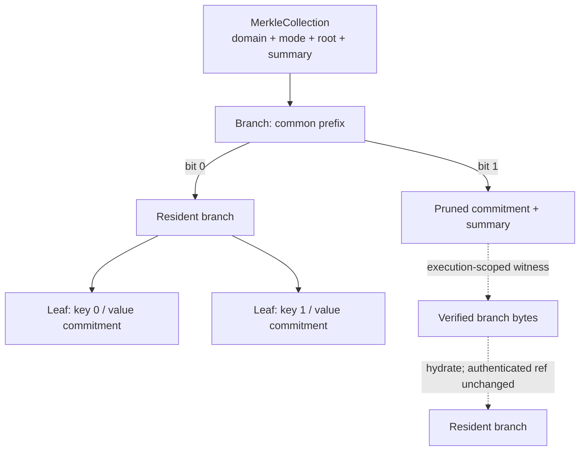

# Authenticated compression

## Status and scope

This is an exploratory subproject. It does not yet define consensus rules or
describe implemented behavior.

Here, **compression** means authenticated pruning: replace resident data with a
small cryptographic commitment while keeping enough witness data elsewhere to
restore selected contents later. **Decompression** means verifying that witness
data against the commitment and materializing it for execution. This is not an
ordinary byte-compression codec and does not, by itself, guarantee that the
witness data remains available.

The immediate scope is actor state, Dict branches, and Cells. A common ordered
Merkle collection may also cover Cell payloads, Taproot program trees, and
Utreexo items. Sharing the primitive does not require every use to share the
same update or ownership policy.

## Core insights

- An actor whose storage lease expires can be **frozen instead of destroyed**.
  Its code and state are replaced by commitments, so its identity and ownership
  relationships survive without keeping the complete state resident.
- Freezing must not retire linear values hidden in actor state. Tokens and other
  non-droppable values cannot be destroyed in bulk; they remain committed under
  the frozen state root until the actor explicitly accesses and disposes of
  them according to normal VM rules.
- A Dict can be committed as a whole while being materialized piece by piece.
  An operation need only provide the branches it reads or changes.
- An actor may eventually be allowed to prune selected Dict branches while it
  is still active, reducing resident storage without freezing all of its state.
- Opening a Cell and restoring a frozen actor are instances of the same basic
  operation: resolve a short authenticated reference using witness data.
- A Cell may itself contain a Dict with pruned branches. Restoring the Cell does
  not require eagerly restoring every branch of every nested Dict.
- Witness data may be supplied explicitly as program data, implicitly through
  the transaction execution context, or through both interfaces.
- These cases may use one content-addressed witness format, one verifier, and
  one set of availability and charging rules.

## One ordered Merkle collection

Dict entries, Cell payload items, Taproot leaves, and Utreexo items have the
same structural core:

- every item has a canonical position in a total order;
- some positions are successive ordinals;
- some positions are arbitrary keys; and
- a root commits to both the items and their order.

The distinction is therefore a **key policy**, not necessarily a different
tree. A candidate common primitive is a canonical binary Merkle-Patricia tree
over fixed-width, order-preserving keys. Patricia compression removes unary
paths, so a 256-bit key space does not imply 256 sibling hashes in every proof.
The binary form should be the first design; wider nodes are justified only if
measurements show a material proof-size or verification advantage.

```text
Key = [u8; 32]

MerkleCollection {
    domain: Domain,
    mode: CollectionMode,
    root: RootRef,
}

CollectionMode {
    Sequence { len: u64 },  // exactly 0 .. len-1
    OrderedMap,             // arbitrary unique keys
}

Node {
    Leaf {
        key,
        value_commitment,
    },
    Branch {
        shared_prefix: BitPrefix { len, bits },
        left: NodeRef,      // next key bit is 0
        right: NodeRef,     // next key bit is 1
    },
}

NodeRef {
    node_hash,
    summary,
    body: Resident(Box<Node>) | Pruned,
}

RootRef {
    Empty,
    Node(NodeRef),
}

Summary {
    item_count,
    logical_bytes,
    key_bounds: Option<(first_key, last_key)>,
    domain_summary,
}
```

For collections of VM `Value`s, `domain_summary` includes the AND of the
currently present values' `portable` and `droppable` capabilities. Other
domains use an empty summary. A Dict's history-sticky runtime flags remain
conservative transient metadata: they are not part of the logical value or its
content root. Reconstruction derives capabilities from the present leaves, and
an empty Dict is droppable even if its former contents were not.

Summaries fold bottom-up: counts and logical byte sizes add, key bounds take
the minimum and maximum, and Value capability bits use AND. The empty summary
has count and logical size zero, no bounds, and neutral `true` capability bits.
`logical_bytes` measures the fully materialized logical value; pruning changes
resident bytes and rent, not this number.

`Resident` and `Pruned` hold the same authenticated `NodeRef`; they differ only
in whether its body is present. An opened witness must reproduce both the node
hash and the summary from the actual node and values. If residency affects
execution, a separate consensus residency commitment records it; a node's
private cache cannot silently turn a pruned branch into a resident one.

Every hash input uses a canonical, length-framed encoding; in particular, a
Patricia prefix commits both its bit length and its masked bytes. The hash rules
are domain-separated and include summaries:

```text
leaf_node   = H(domain, "leaf", key, value_commitment)
branch_node = H(domain, "branch", shared_prefix, left.ref_hash, right.ref_hash)
ref_hash    = H(domain, "ref", node_hash, summary)
empty_root  = H(domain, "empty")
root        = H(domain, "collection", mode, empty_root | top_ref.ref_hash)
```

The canonical shape has no one-child branches, stores the maximal shared
prefix once, and always orders child `0` before child `1`. Its root is therefore
independent of insertion order and of which nodes are resident. The empty
collection has a domain-separated empty commitment and `key_bounds = None`.
The inherited depth fixes where each prefix starts; unused prefix bits are
zero, depth strictly advances, both children exist, child bounds match their
prefix and branch bit, and all summary arithmetic is checked against consensus
bounds.



### Canonical keys

One fixed-width key representation can preserve the native ordering of each
view:

- sequential positions use a big-endian unsigned ordinal;
- signed `Int253` Dict keys use an order-preserving rank encoding;
- current Taproot leaves use successive ordinals; a future sparse design could
  instead use derived blinded keys; and
- Utreexo has a dense logical order, while its current proof `position` stores
  tree-relative direction bits rather than a stable global item index.

The collection domain and mode are committed at the root, so identical key and
value bytes cannot be reinterpreted between a Dict, Cell payload, predicate
tree, or accumulator.

For an `Int253` with magnitude `m` and maximum canonical scalar magnitude
`M = ℓ - 1`, encode rank `M - m` when negative and `M + m` otherwise, then
write the rank as 32-byte big-endian. This orders `-M .. -1, 0, 1 .. M`
lexicographically without relying on the native sign-magnitude bytes.

`Sequence { len }` requires unique keys exactly covering `0..len`, and `len`
must fit both the key space and the consensus collection size bound. For a
non-empty sequence, the root summary proves this compactly when
`item_count == len` and `key_bounds == Some((0, len - 1))`; the unique-key tree
then has no room for a gap. For `len == 0`, the count is zero and the bounds are
`None`. `OrderedMap` permits arbitrary keys, including ordinal keys with holes.
Big-endian ordinals are zero-extended to 32 bytes.

Each domain fixes one canonical mode; mode is not a caller choice. Cells and
the current Taproot tree use `Sequence`. Dict always uses `OrderedMap`, while
its existing wire codec may omit exact keys `0..len` as a list-size
optimization without changing the committed mode. A future sparse Taproot tree
with derived blinded labels would instead define an `OrderedMap` domain.

### Specialized views

| Use | Collection view | Leaf value | Additional rule |
| --- | --- | --- | --- |
| Cell payload | `Sequence { len }` | portable `Value` | Cell identity commits the payload root and length. |
| Dict, including list-style encoding | `OrderedMap` | `Value` | Keys use signed `Int253` numeric order; exact `0..len` may omit keys on the wire. |
| Taproot predicate | `Sequence { len }` | program or opaque blinding leaf | Current blinding randomizes each program/blinding pair's orientation; the root feeds the internal-key tweak. |
| Utreexo | dense `Sequence`, if redesigned; otherwise its existing forest | `CellID` | Positions move during normalization; update/catchup remains domain-specific. |

A hidden subtree needs no separate item number: its authenticated key prefix
locates its pruned commitment. The current Taproot construction instead uses a
successive leaf sequence and randomizes the left/right orientation within each
program/blinding pair; pseudorandom keyed leaves would be a future redesign.

Utreexo may keep its forest-of-perfect-trees root wrapper for batched deletion
and proof catchup. In that case it can still reuse domain hashing conventions
and the resident/pruned witness envelope; exact Patricia nodes and proofs are
shared only if Utreexo is deliberately reimplemented on the common tree. The
goal is not to erase useful domain-specific algorithms.

This is consensus-format redesign, not transparent implementation reuse.
Today Cell IDs hash payload items directly, and Taproot and Utreexo use their
own leaf and branch hashes without Patricia prefixes or summaries. Moving any
of them to this collection changes its roots, IDs, proofs, and test vectors.

### Proofs and operations

One opening proof contains the expected domain, collection root and mode, the
requested key, the leaf or first divergent prefix, and the sibling commitments
from leaf to root. The same proof form supports:

- membership and value materialization;
- authenticated absence;
- point insertion, removal, and replacement; and
- pruning or hydrating a whole subtree.

Ranges and consecutive-index claims use a canonical multiproof that opens the
range boundaries and all covered subtree commitments; one point proof is not
enough.

Missing witness data is different from proven absence. An empty collection or
a proof ending at the first divergent leaf/prefix proves that a key is absent.
A path that reaches a pruned reference without its execution-scoped witness
fails `MissingWitness`.

Linearity is a policy above the proof format. A witness proves bytes; it never
mints a stack `Value`. Hydration replaces a pruned reference inside the same
uniquely owned collection. Extracting a token-bearing leaf atomically consumes
the old collection state and returns a new root plus the value; on failure,
both the root and returned call arguments roll back together. Read-only access
may expose only copyable values. A partially opened Cell likewise needs either
to consume the whole Cell or to return a residual committed payload containing
every unopened linear value.

## Actor lifecycle

The proposed lifecycle is:

```text
resident actor
    | storage expiry or explicit freeze
    v
frozen actor: ActorID + code/state commitments + capability summaries
    | transaction supplies the witnesses needed by this execution
    v
transiently materialized actor
    | successful save
    v
resident, partially pruned, or frozen actor state
```

A frozen actor remains addressable. A transaction that supplies sufficient
witnesses can execute it and save a new state. Missing witness data causes that
execution to fail; it does not erase the actor.

Explicit permanent actor destruction, if retained, is a separate operation. It
must prove that no linear value is being discarded rather than inheriting the
old lease-expiry bulk-destruction behavior.

Freezing changes the meaning of storage rent: rent pays for resident,
witness-free availability, not for logical existence. The permanent actor
record still has a global cost, so consensus must eventually price or
accumulate those records rather than assuming that a 32-byte root is free.

## Partially materialized Dicts

A Dict always uses the common `OrderedMap`; exact keys `0..len` merely enable
the existing shorter list-style wire encoding. There is therefore no runtime
mode bit or conversion rule for Dict. Its canonical **content root** is
independent of which branches are currently resident.

Each pruned branch needs enough authenticated summary data to preserve the
rules that would apply if it were resident:

- subtree commitment;
- entry count and logical encoded size;
- `portable` summary; and
- `droppable` summary.

The parent commitment must commit to these summaries. A branch hiding a token
must therefore remain non-droppable, while a proven empty branch may be
droppable. Pruning and hydration do not copy or move VM values; they change only
the representation of the same logical Dict.

A lookup that reaches a pruned branch asks the current execution's witness
provider for that branch. A valid proof of absence produces normal Dict
not-found behavior. A missing proof is a distinct hard `MissingWitness`
failure. An update consumes the old authenticated path and commits a new one,
so a witness for an earlier root cannot be replayed after mutation.

Optional partial compression should be built on this same representation:
pruning a chosen branch changes residency and storage charges, not the content
root. Because residency controls whether execution requires a witness, the
actor record must separately commit its residency map (or an equivalent
availability root). Local caches never change that committed map. There is no
need for a second compression format.

## Cells and frozen actors

Cells and frozen actors differ in ownership but can share restoration
machinery:

| Property | Cell | Frozen actor |
| --- | --- | --- |
| Identity | Cell ID and anchor | Actor ID and state version/root |
| State | Immutable, single-use | Mutable after authenticated restoration |
| Witness result | Cell payload/program | Actor code and selected state branches |
| Consumption | Cell is opened or spent | Actor remains and receives a new state root |

Both can use content-addressed witness blobs and authenticated paths. Cells may
also contain compressible Dicts, so restoration should be lazy across nested
objects rather than recursively materializing everything.

## Witness delivery

Two interfaces are useful:

1. **Explicit:** the program receives witness values and invokes a restore
   operation. This is simple and visible, but exposes proof plumbing to every
   contract.
2. **Implicit:** the transaction carries a witness bag outside the program.
   Dict lookup, Cell opening, or actor restoration asks the execution context
   for the required object. Programs use short IDs and keys.

The implicit form is the better default for ordinary programs. An explicit
form may remain useful when a contract needs to inspect or forward proof data.
Both forms should feed the same verifier.

Witness availability must be scoped to a particular execution. A block may
deduplicate identical bytes physically, but it must not make every block
witness visible to every transaction or message. Otherwise one transaction can
change from failure to success merely because an unrelated transaction happens
to carry the missing witness.

A possible block representation is:

```text
WitnessTable:       WitnessID -> bytes
ExecutionManifest: transaction/message -> ordered WitnessIDs
```

The ordered manifest has its own root. An external transaction's TxID and
signature commit that root, and each asynchronous `MessageID` commits the root
of the witness IDs visible at delivery. A block may deduplicate identical bytes
in `WitnessTable`, but that physical optimization never expands a manifest.

Consensus rules should include:

- an execution sees only its own manifest;
- there is no fallback to a node's private cache, archive, or network;
- a manifest reference with absent bytes or a hash mismatch makes the block
  invalid;
- a required witness absent from the manifest causes deterministic execution
  failure;
- valid witness data guarantees availability of that object, though execution
  may still fail for another reason;
- unused witnesses are allowed only if they are committed and charged; and
- asynchronous messages commit to the witness scope they will receive, so a
  message ID also commits to any witness-dependent behavior.

A referenced witness missing from the table or failing its hash makes the block
invalid. A witness needed by execution but absent from that execution's
manifest produces `MissingWitness`: an external transaction is rejected, while
a failed asynchronous delivery follows the normal bounce path. Synchronous
calls inherit the enclosing manifest and their existing call-failure behavior.

For delayed asynchronous delivery, the message commits ordered witness hashes,
not necessarily the bytes. The later delivery block supplies those bytes in
its table and scopes them to that message; if nobody retains them, delivery
deterministically fails. This keeps each validating block self-contained and
does not charge the message queue for duplicate witness blobs.

Synchronous calls can share the enclosing execution's witness scope. The actor
and state root against which a proof is checked must still be explicit in the
lookup key.

## Common and adjacent applications

| Application | Common pattern | Important difference |
| --- | --- | --- |
| Actor state | Root plus selectively restored collection | Mutable identity and linear values |
| Dict | Ordered collection plus key-path proofs | Fine-grained reads and updates |
| Cell | ID plus committed payload collection | Immutable and single-use |
| Utreexo | Dense forest plus membership proof | Batch updates and proof catchup |
| Taproot program tree | Sequential program/blinding collection | Usually reveals one immutable branch |

Utreexo already demonstrates the compact-state-plus-witness model. Taproot
demonstrates selective program revelation. Use both as conformance cases for
the common commitment and witness conventions, while keeping Utreexo's
forest/catchup rules and Taproot's internal-key tweak outside the generic layer.

## Safety requirements

Any design in this subproject must preserve these properties:

- **Canonical state:** resident and pruned representations have the same
  content root, while consensus separately commits any residency distinction
  that affects witness requirements.
- **Linearity:** hiding a value never makes it droppable or duplicable.
- **Scoped availability:** success cannot depend on witnesses supplied to an
  unrelated execution or retained privately by a node.
- **Deterministic failure:** missing, malformed, and valid absence proofs have
  distinct consensus outcomes.
- **Atomic rollback:** a failed execution restores the same actor root,
  residency metadata, and witness obligations it started with.
- **Bounded work:** witness bytes, proof verification, materialized nodes, and
  resulting resident storage are charged and limited.
- **Block self-containment:** validation does not require fetching data from the
  network during execution.
- **Data availability:** commitments preserve integrity, not availability;
  owners or archival services must retain the witness data needed for future
  restoration.

Witnesses included in a block also reveal their data to block observers.
Privacy, encryption, and zero-knowledge access are separate concerns.

## Open decisions

- Canonical key width and encoding, node encoding, proof format, and size bounds.
- Whether Utreexo uses the common tree or only its commitment/witness
  conventions while retaining the current forest wrapper.
- Whether Taproot leaves use successive positions or blinded derived keys.
- Whether actors freeze automatically on lease expiry, explicitly, or both.
- Which actor metadata remains resident and how its permanent cost is bounded.
- Whether actor code can be pruned separately from state.
- Exact explicit and implicit witness APIs.
- Canonical encoding and data-retention obligations for witness manifests
  committed by asynchronous messages and bounces.
- Whether partial Dict pruning is actor-controlled or only a storage-layer
  representation choice.
- Maximum String and program sizes, so large portable data has one canonical
  chunking path through Dicts.
- Which witness bytes are retained across reorganization and archival pruning.
- How much implementation Utreexo and Taproot can share without replacing
  their useful domain-specific wrappers.

## Proposed work order

1. Specify the common collection's key encodings, commitments, capability
   summaries, authorization-bound witness scoping, and failure semantics.
2. Prototype the binary Patricia node once, then test both `Sequence` and
   `OrderedMap` views for lookup, absence, update, rollback, pruning, and
   hidden-token droppability.
3. Add a transaction-scoped witness provider and block manifest.
4. Freeze and restore actor state using the Dict mechanism, while treating a
   bounded non-Dict state as one witness blob.
5. Reuse the provider for Cell restoration and nested Dict payloads.
6. Validate the commitment and witness conventions against Utreexo proof
   catchup and Taproot openings; keep their forest and tweak wrappers
   domain-specific, sharing exact node/proof code only if that is simpler.
